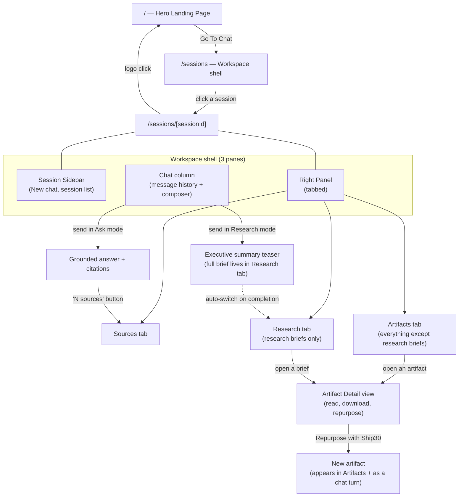
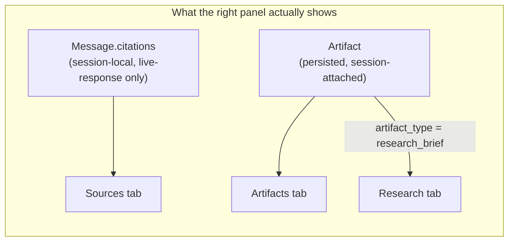

# UI/UX Design Document — Lenny Growth Assistant

> This document explains *why* the product looks and behaves the way it does — the reasoning behind the workflows, the panel layout, the navigation, and the specific UX bugs that were found and fixed during development. It is written from the actual, current implementation (`frontend/`), not from an aspirational spec — where a decision changed over time, the "before" state and the reasoning that replaced it are both documented, because the reasoning is more reusable than the final pixel values.

---

## Table of Contents

- [Design Philosophy](#design-philosophy)
- [Product Vision](#product-vision)
- [User Personas](#user-personas)
- [User Journey](#user-journey)
- [Information Architecture](#information-architecture)
- [Navigation Design](#navigation-design)
- [Workspace Layout](#workspace-layout)
- [Sources Experience](#sources-experience)
- [Research Experience](#research-experience)
- [Artifact Experience](#artifact-experience)
- [Landing Page Design](#landing-page-design)
- [Thinking State UX](#thinking-state-ux)
- [Accessibility](#accessibility)
- [Responsiveness](#responsiveness)
- [UX Iterations During Development](#ux-iterations-during-development)
- [Future UX Improvements](#future-ux-improvements)
- [Design Principles Learned](#design-principles-learned)

---

## Design Philosophy

The workspace is built around one governing idea: **the podcast corpus is the product, not the chat interface.** A chat window is the *access mechanism* to 303 episodes of tactical product/growth advice — it is not itself the value. Every design decision downstream of that idea follows the same four commitments:

**Simplicity.** There is exactly one composer, with exactly one binary choice in front of it (**Ask** vs **Research**) — not a skill picker with four options, not a settings panel, not a model selector. A user should never have to understand the system's internal architecture (QA skill vs. Research skill vs. Ship30 skill vs. a routing layer) to use it correctly. The binary toggle *is* the entire mental model exposed to the user; everything else (skill dispatch, retrieval, grounding checks, artifact persistence) happens behind it.

**Focus.** Each surface in the UI has exactly one job. The chat column is for *reading an answer*. The right panel is for *everything about where that answer came from or what it produced* — sources, generated briefs, generated content. Nothing is duplicated between them by accident; where something does appear in two places (the Research chat message and the Research tab), it's a deliberate, reasoned split, not an oversight (see [Research Experience](#research-experience)).

**Clarity over cleverness.** Assistant answers render as plain, document-style prose — no chat-bubble box, no decorative avatar animation, no unnecessary chrome — because the actual content (a cited claim from a podcast transcript) is confident enough not to need visual embellishment to feel authoritative. Where a claim needs to be trusted, it's backed by a citation the user can actually open and read the source excerpt of, not just a footnote-style marker.

**Knowledge-first workflows.** The three capabilities (Ask, Research, Ship30) are ordered by escalating *knowledge investment*, not by engineering complexity: a quick factual lookup (Ask) escalates naturally into a structured investigation (Research), which escalates naturally into publishable output (Ship30). The UI reflects this progression directly — Ship30 generation is only reachable *from* an existing artifact ("Repurpose this with Ship30"), never as a cold-start action, because repurposing something you don't yet have doesn't make sense. The workflow enforces the same order a person's thinking actually follows: learn → synthesize → publish.

## Product Vision

Lenny Growth Assistant exists to collapse the distance between *"I have a vague question about product growth"* and *"I have a cited answer, a synthesized brief, and a publishable post,"* without ever leaving one continuous, persisted workspace. The product's differentiated bet is that **trust is a UX problem, not just a model-quality problem**: an answer is only useful to a growth practitioner if they can verify it traces back to a real guest, a real episode, and a real moment in that conversation. So the product treats "show your sources" as a first-class, always-visible capability, not a debug feature hidden behind a toggle.

## User Personas

### The Knowledge Worker
Needs a fast, trustworthy answer to a specific tactical question ("what do guests say about activation metrics?") without listening to hours of audio. Primary workflow: **Ask**. Success looks like: a short, cited answer in under a minute, with the option to verify the source excerpt if the claim matters enough to double-check.

### The Creator
Writes LinkedIn posts, threads, or articles about product/growth topics and needs source material that sounds credible because it's actually attributable to named operators. Primary workflow: **Ask/Research → Ship30**. Success looks like: a publishable draft derived from real guest insight, in the platform-specific format (character limits, thread segmentation) they'd otherwise have to enforce by hand.

### The Researcher
Compiling a structured view of how *multiple* guests think about a topic — comparing perspectives, not just retrieving one fact. Primary workflow: **Research**. Success looks like: a multi-section brief (Executive Summary, Key Insights, Supporting Evidence, Recommended Actions) that actually draws on more than one episode, with every claim traceable back to its source.

### The Professional Learner
Returns to the tool across multiple sessions over days or weeks, building a personal library of prior questions, briefs, and generated content as a durable reference — not a one-shot query tool. Primary workflow: **Sessions + Artifacts**. Success looks like: reopening a session from three days ago and finding the exact brief and the LinkedIn post generated from it, still there, still downloadable.

These four personas map directly onto the four capability cards on the Hero Landing Page (Ask questions / Research topics / Generate content / Discover growth insights) — the marketing surface and the product's actual information architecture are the same taxonomy, deliberately, so the landing page never over-promises something the workspace doesn't deliver.

## User Journey

### Landing Page

A first-time visitor lands on `/`, not directly in a chat window. This is a deliberate sequencing choice: chat-first products (a bare textbox on load) force the user to guess what's in scope ("can I ask it anything, or just about this podcast?"). The Hero Landing Page answers that question *before* the user has to type anything — logo, product name, a headline, a one-paragraph description naming the four things it does, and a single unambiguous next step: **Go To Chat**.

### Ask Workflow

```
User has a specific question
  → types it into the composer (default "Ask" mode)
  → sees "Thinking…" immediately (see Thinking State UX)
  → receives a grounded answer, inline-cited
  → optionally clicks "N sources" to open the Sources tab
       and read the exact transcript excerpt(s) the claim came from
```

The workflow has exactly one branch point most users never see: if the retrieved excerpts don't substantively answer the question, the system says so plainly ("I don't have enough information…") instead of producing a confident-sounding but ungrounded answer. From a UX standpoint this is a trust-preserving design choice — a wrong-but-confident answer costs more trust than an honest "I don't know," and the product is explicitly built to prefer the latter (see `docs/ARCHITECTURE.md`'s grounding requirements and the backend's two-stage enforcement).

### Research Workflow

```
User has a broader topic, not a single fact
  → toggles the composer to "Research"
  → types the topic, sends
  → sees "Thinking…" for a materially longer duration
       (multiple retrieval calls + a longer synthesis generation)
  → chat shows a short title + executive-summary teaser
  → right panel auto-switches to the Research tab
  → full multi-section brief is there, with per-episode sourcing
```

The auto-switch to the Research tab on completion is a deliberate hand-off: the user doesn't have to know where the full output landed, because the interface takes them there the moment it exists.

### Artifact Workflow

```
User has an existing brief or Ship30 output open (Artifacts or Research tab)
  → scrolls to "Repurpose this with Ship30"
  → optionally edits the framing instruction
       (default: "Repurpose this content.")
  → picks LinkedIn post / X thread / Article
  → button shows "Generating…" immediately, disables its siblings
  → on success: returns to the artifact list
       (the new piece is now visible there, and also as a new chat turn)
```

Ship30 generation deliberately has no separate "create new artifact" entry point in the workspace's main navigation — it only ever exists as an action *inside* an already-open artifact. This isn't a limitation; it's the workflow's core assertion: **you cannot generate content from nothing.** Something has to already exist to repurpose.

## Information Architecture



The information architecture is intentionally **flat**, not hierarchical: there is no nested navigation, no breadcrumb trail, no multi-level menu. Every piece of content is at most two clicks from the workspace root — sidebar to a session, session to a tab, tab to an artifact. The only "back" affordance that exists is the Artifact Detail view's own **Back** button (returning to the list it came from) and the logo link (returning to the Hero page) — because there's never a third level deep enough to need more than that.



This second diagram matters because it's a real, load-bearing constraint on the UX, not just a data model detail: **citations shown in the Sources tab are only ever available for the message you just viewed** — reopening an old session does not restore historical citations into that tab (they're rehydrated per-message from the live response, not fetched from the session-history endpoint). The Sources tab is a "what grounded *this*" view, scoped to the current interaction, not a permanent citation library. Artifacts, by contrast, are fully persisted and durable across sessions — that distinction (ephemeral proof-of-grounding vs. durable output) is exactly why they live in separate tabs rather than one merged "everything" panel.

## Navigation Design

| Surface | Reached from | Purpose |
|---|---|---|
| **Hero Landing Page** (`/`) | Direct visit, or the workspace logo | Orient a new visitor; single CTA into the product. Not a dead end — it's a real, revisitable page, not just a splash screen. |
| **Workspace** (`/sessions`) | "Go To Chat" CTA, or any session link | The default "no session selected" state — a calm empty state, not an error. |
| **Sessions** (sidebar) | Always visible inside the workspace | Persistent left rail; every session is one click away, ordered by recency so the most relevant work is always at the top with no scrolling for active use. |
| **Sources tab** | Default-active tab; also reached via a message's "N sources" button | The trust-verification surface — always the *first* tab, because grounding is the product's core promise and shouldn't require a click to discover it exists. |
| **Artifacts tab** | Right-panel tab | The durable-output surface — everything generated except research briefs. |
| **Research tab** | Right-panel tab; also auto-selected when a brief finishes generating | The synthesis surface — deliberately separated from Artifacts (see [Research Experience](#research-experience)) despite sharing the same underlying data and list machinery. |

The tab *order* — Sources, then Artifacts, then Research — mirrors the natural escalation path described in [Design Philosophy](#design-philosophy): verify → generate → synthesize-and-publish is not quite the literal order, but Sources-first reflects that trust-verification is the thing every other tab's output ultimately depends on, so it earns the leftmost, default-active position.

## Workspace Layout

The workspace is a fixed three-pane shell (`(workspace)/layout.tsx`), the same shape on every session:

```
┌──────────────┬───────────────────────────────┬─────────────────────┐
│   Sidebar    │            Chat                │     Right Panel     │
│   (256px)    │         (fills remaining        │       (450px)       │
│              │          space, flexible)       │                      │
│  Logo → Hero │                                 │  Sources | Artifacts │
│  New chat    │  Message history                │        | Research    │
│  Session     │  (document-style assistant      │                      │
│  list        │   text, bubble-style user text) │  Tab content         │
│              │                                 │                      │
│              │  Composer: Ask/Research + input  │                      │
└──────────────┴───────────────────────────────┴─────────────────────┘
```

**Sidebar (fixed 256px)** — never scrolls horizontally, never resizes. Its job is pure navigation: switch sessions, start a new one. It intentionally carries no session *metadata* beyond a title and a relative timestamp — no message count, no skill-used badges, no unread indicators — because none of that changes which session a user wants to open; it would be information without a decision behind it.

**Chat column (flexible, `min-w-0 flex-1`)** — absorbs whatever width the other two fixed-width panes don't use, so it's the pane that actually benefits from a wider monitor. This is deliberate: the chat transcript is the highest-value reading surface, and reading text benefits from width far more than a session list or a citation card does.

**Right panel (fixed 450px, increased from an original 320px)** — see [Sources Experience](#sources-experience) and [UX Iterations](#ux-iterations-during-development) for the specific reasoning; the short version is that citation excerpts and artifact previews were measurably cramped at the narrower width, and this pane's content (quoted prose) benefits from width the same way the chat column does, just at a smaller, fixed scale appropriate to a side panel rather than a primary reading surface.

## Sources Experience

**Source visibility** is treated as a default-on feature, not an opt-in one. Every assistant answer that used retrieved context shows a "N sources" button directly beneath it — not hidden behind a menu, not requiring hover to discover. Clicking it does two things atomically: switches the right panel to the Sources tab *and* loads that specific message's citations into it, so the user never has to manually correlate "which tab has the sources for the thing I just read."

**Citation workflow**: each source renders as a numbered card — a small circular index badge matching the `[1]`/`[2]` inline markers in the answer text, a one-line episode/timestamp label, and the actual quoted transcript excerpt in a distinct serif typeface. That typographic choice is deliberate: Source Serif 4 is reserved *exclusively* for this one context (quoted, verbatim source material) across the entire app — nowhere else in the UI uses it — so a user learns, after seeing it once, that serif italic text always means "this is a direct quote from a real episode," without needing a label to say so.

**Expanded viewport design**: the right panel's width was deliberately increased (320px → 450px) specifically because this is where the app's most content-dense material — quoted excerpts, artifact previews — has to live legibly. A narrow citation panel that truncates or wraps awkwardly undermines the exact thing it exists to prove (that the source material is real and readable) — so this pane earns more width than a typical sidebar-style panel would default to.

## Research Experience

**The core decision**: the chat transcript shows only a title and an executive-summary teaser for a Research response — never the full multi-section brief. The full brief (Key Insights, Supporting Evidence, Recommended Actions, and a sourced citations appendix) exists exclusively as a persisted Artifact, viewed through the Research tab.

**Why**: earlier in development, a Research response rendered its *entire* structured brief directly into the chat transcript. This produced a specific, measurable UX problem — the Research tab, which exists specifically to be "your research workspace," felt redundant the moment it was opened, because everything in it had already been read in the chat. A dedicated tab that never tells you anything new fails at its one job.

The fix reframes the chat message as a **pointer**, not a **copy**: "here's the topic, here's the one-paragraph takeaway, go to the Research tab for the full structured brief." This mirrors a pattern common to well-designed research/reporting tools generally — a notification summarizes; a report is where you actually go to read. It also has a secondary, compounding benefit: a long chat transcript with several research briefs in it stays scannable (a title + one paragraph, not four full sections, per entry), which matters more the longer a session's history grows.

**The reasoning generalizes**: this same "summary where you are, full detail where its home is" pattern is exactly why Ship30 output *also* creates a chat message (a lightweight confirmation that something new got made) while its actual body lives in the Artifacts tab — the same tension (don't duplicate the same content across two homes) applies, and got the same answer, once the pattern was recognized during Research's redesign.

## Artifact Experience

**Lifecycle**: an artifact is born from exactly one of two events — a Research run (`artifact_type = research_brief`) or a Ship30 generation (`linkedin_post` / `x_thread` / `article`). It is never created directly by a user action with no generative step behind it; there is no "blank new artifact" button anywhere in the UI. This is a deliberate constraint, not a missing feature: an artifact's entire reason for existing is that it's a durable record of *something the system produced*, not a user-authored document — so the workspace never pretends otherwise by offering an empty-artifact affordance.

**Ordering**: both the Artifacts and Research tabs sort their contents most-recent-first. This matches the same recency-first convention as the session sidebar — the thing a user almost always wants after generating something is the thing they just generated, not something from a week ago requiring a scroll.

**Creation flow**: from inside any open artifact, the "Repurpose this with Ship30" panel offers three explicit buttons (LinkedIn post / X thread / Article) rather than a dropdown-plus-submit — every option is visible and one click away, because there are only three and they're mutually exclusive per click, so a dropdown would add a step without reducing any real complexity. On generation, the clicked button's own label swaps to "Generating…" (not a separate global spinner) so the exact action in flight is visible at the exact place the user's attention already is, and its sibling buttons + the instruction field disable together, preventing a second, conflicting generation request mid-flight.

**Two presentations, one data source**: the Artifacts tab and Research tab both read the identical underlying artifact list, filtered to be mutually exclusive (`research_brief` only vs. everything else) — but they render each row differently. A generic artifact gets a file-preview row (type badge, timestamp, first line of content). A research brief gets a dedicated row — a lightbulb icon, its actual title, a one-line summary, and a source count — because "how many sources does this synthesis draw from" is a meaningful, at-a-glance trust signal specifically for a research brief, in a way it isn't for a LinkedIn post.

## Landing Page Design

**Branding**: the logo appears once, prominently, at the top of the Hero page — large enough (72px) to be the clear visual anchor of the page, above a small uppercase "LENNY GROWTH ASSISTANT" label in the brand's accent color. The same logo, at a smaller scale (28px), reappears in the workspace header, now doubling as a navigational element (a link back to the Hero page) rather than pure branding — one asset serving two distinct roles depending on context, rather than shipping a second brand mark for the workspace chrome.

**CTA placement**: "Go To Chat" sits dead-center, directly beneath the description, before the four capability cards — a user should never have to scroll to find the one thing this page wants them to do. The capability cards exist *below* the fold-line intentionally: they're supporting evidence for someone who wants to understand the product before committing, not a prerequisite to acting on it.

**Visual hierarchy**: logo → eyebrow label → headline → description → CTA → supporting detail, in strictly decreasing "you must read this" order, using both type scale and color weight (the headline is the largest, darkest text on the page; the description drops to a lighter muted tone; the capability cards' body copy is smaller still). This is a conventional SaaS-landing hierarchy on purpose — the goal here isn't novelty, it's zero-friction comprehension for a first-time visitor.

## Thinking State UX

**The problem this section documents**: sending the very first message in a brand-new session did not show a "Thinking…" indicator — the UI appeared to do nothing for the entire duration of the request, only to display the answer (with no visible transition) once it arrived. Every subsequent message in that same session worked correctly.

**Root cause**: the chat page's content area was gated by a single condition — `session.messages.length === 0 ? <EmptyState /> : <MessageList />` — and `MessageList` was the *only* component that ever rendered the "Thinking…" indicator. For a session's first message, `session.messages` is genuinely empty until the response comes back and the session is refetched, so the ternary kept `EmptyState` mounted for the entire request — `MessageList`, and therefore the loading indicator, had nowhere to appear. From the second message onward, `messages.length` was already greater than zero, so the bug was invisible.

**The fix**: one additional clause — `session.messages.length === 0 && !sendMessage.isPending`. The moment a send is in flight, the branch falls through to `MessageList` regardless of whether any messages exist yet, so the indicator can mount immediately.

**Why this matters as a UX principle, not just a bug fix**: the very first interaction a new user has with the product is exactly the interaction that most needs instant feedback — it's the moment they're deciding whether the tool is responsive at all. A loading-state bug that only affects first messages is, in effect, a first-impressions bug. It was treated with that priority: a one-line, minimal fix, verified live for QA, Research, and repeated across both new and existing sessions, rather than deferred as a low-priority edge case.

**Loading behavior generally**: every asynchronous action in the workspace follows the same convention — the specific control that triggered it (the send button implicitly via the composer disabling, or an explicit "Generating…"/"Downloading…" button-label swap for Ship30/artifact-download) reflects its own pending state locally, rather than a single global spinner overlay. A user should always be able to tell *which* thing is loading, not just that *something* is.

## Accessibility

- **Live regions**: the "Thinking…" indicator carries `role="status"` and `aria-live="polite"`, so a screen-reader user is told a response is in progress without an interruptive announcement.
- **Composer mode toggle**: the Ask/Research switch is a real `role="radiogroup"` with `aria-checked` on each option, not a pair of unrelated buttons — so assistive technology correctly announces it as a single two-state control.
- **Keyboard-first composer**: Enter sends, Shift+Enter inserts a newline — the conventional chat-input contract, not a novel one a user has to learn.
- **Focus visibility**: every interactive element uses a consistent, visible focus ring (`:focus-visible` with an accent-colored ring and offset) defined once globally, so keyboard navigation is legible everywhere, not just on a subset of hand-styled controls.
- **Icon-only affordances have text alternatives**: purely decorative icons (the Sparkles mark in empty states, the lightbulb on a research-brief row) are `aria-hidden`; icons that *are* the control (the send button) carry an explicit `aria-label`.
- **Session identification**: the active session in the sidebar is marked `aria-current="page"`, not conveyed by color alone.
- **Alt text on the brand logo**: descriptive (`"Lenny Growth Assistant logo"` / `"Back to Lenny Growth Assistant home"`), reflecting the image's *function* at each occurrence rather than a generic filename-derived label.

## Responsiveness

The Hero Landing Page is built mobile-first: the logo, headline type scale, and capability-card grid all step up at the `sm`/`md` breakpoints from single-column, smaller-type defaults, rather than being designed at desktop width and shrunk down. The workspace itself is currently optimized for a desktop-width, three-pane layout (fixed sidebar + fixed right panel + flexible center) — this is an explicit, current scope boundary rather than an oversight: a three-pane information-dense workspace (session list, chat, and citations/artifacts simultaneously visible) is a desktop-native interaction pattern, and collapsing it correctly for a narrow viewport (which pane hides first, how sources/artifacts get reached on mobile) is a real design problem that hasn't been solved yet — see [Future UX Improvements](#future-ux-improvements).

## UX Iterations During Development

Each of these is a real problem encountered, diagnosed, and fixed during this project's development — documented with the same rigor as the code comments that describe them, because the reasoning behind a fix is more valuable long-term than the fix itself.

### 1. Research duplication issue

**Problem**: a Research request's full, structured brief was rendered directly into the chat transcript.
**Root cause**: the Research skill originally returned one Markdown body used for *both* the chat message and the persisted artifact — there was no split between "what the chat shows" and "what the artifact stores."
**Solution**: the Research skill now produces two distinct outputs from one synthesis pass — a short chat-facing summary (title + executive summary + a pointer to the Research tab) and a separate, complete artifact body (all four sections plus a citations appendix).
**Impact**: the chat transcript stays scannable even after several research runs in one session, and the Research tab regained a genuine reason to exist — it's no longer a second copy of something already fully read.

### 2. Research vs. Artifacts separation

**Problem**: research briefs and Ship30 outputs (LinkedIn posts, threads, articles) were conceptually different things — one is *synthesized investigation*, the other is *publishable content* — but both are stored as the same underlying `Artifact` record with no natural place to distinguish them in the UI.
**Root cause**: a single "Artifacts" list, undifferentiated by type, forced a user to scan past research briefs to find generated posts, and vice versa — two different mental tasks sharing one flat list.
**Solution**: one shared list-fetching/selection mechanism (`ArtifactsList`) now renders two mutually-exclusive, purpose-built views over the same data — a Research tab (`filterType="research_brief"`, with a title/summary/source-count row) and an Artifacts tab (`excludeType="research_brief"`, with a generic file-preview row) — rather than either duplicating the fetch logic or forcing one shared visual treatment onto two different content types.
**Impact**: each tab now answers exactly one question ("what has this session synthesized?" vs. "what has this session published?"), and a new artifact type introduced in the future defaults into Artifacts automatically (an exclusion list, not an inclusion list), requiring no tab-assignment decision at the time it's added.

### 3. Sources panel height/width improvement

**Problem**: citation excerpts (quoted transcript text) and artifact preview rows felt cramped, with text wrapping awkwardly at the panel's original 320px width — and in one specific case, an excerpt appeared visually clipped rather than wrapped.
**Root cause**: two compounding issues. First, 320px is simply narrow for a pane whose primary content is prose meant to be read, not skimmed. Second, a deeper rendering bug: `truncate` (which sets `white-space: nowrap`) was used on a label inside a `ScrollArea`'s Radix Viewport — a viewport implemented as `display: table` internally, whose width is computed from its content's *unwrapped* natural width. A `nowrap` descendant fed its full, un-wrapped width back into that table-layout width calculation, forcing the entire citation card (not just the label) to overflow past the sidebar's right edge — a `min-w-0` on ancestor elements doesn't stop this, because table auto-sizing isn't governed by flex-shrink rules.
**Solution**: the right panel's fixed width was increased from 320px to 450px, and the truncation technique was switched from `truncate` to `line-clamp-1`/`line-clamp-2` (CSS line-clamping, which clips visually without forcing single-line, unwrapped layout) on every label sharing this `ScrollArea`-inside-a-fixed-width-pane pattern (citation cards, generic artifact rows, research-brief rows alike).
**Impact**: fixes both the immediate legibility complaint (more breathing room for quoted text) and a structural rendering bug that would have resurfaced on any future component reusing the same `truncate`-inside-`ScrollArea` pattern — the fix was applied consistently across every affected component, not just the one where it was first noticed.

### 4. First-message thinking state fix

**Problem**: sending the first message in a brand-new session showed no loading feedback for the entire request duration; every message after the first worked correctly.
**Root cause**: see [Thinking State UX](#thinking-state-ux) — the empty-state/message-list ternary excluded the only component capable of rendering the loading indicator, specifically during the one window (an empty message history) where a first message is being sent.
**Solution**: a single added clause (`&& !sendMessage.isPending`) to the same ternary, so a pending send always falls through to `MessageList` regardless of whether the session already has messages.
**Impact**: verified live across new sessions, existing sessions, Ask mode, and Research mode — a one-line change closing a first-impressions-critical gap, with zero change to any business logic, loading semantics, or unrelated UI.

### 5. Landing page introduction

**Problem**: the application's root route (`/`) originally redirected straight into the workspace (`/sessions`) — there was no page that explained what the product was, who it was for, or what it could do, before dropping a first-time visitor into an empty chat shell.
**Root cause**: a chat-first entry point assumes the visitor already knows the product's scope; for an unfamiliar visitor, an empty composer with no framing is a blank-page problem, not a welcoming one.
**Solution**: `/` now renders a dedicated Hero Landing Page — logo, product name, headline, a description naming all four core capabilities, and a single, unambiguous **Go To Chat** CTA into the existing, entirely unmodified workspace.
**Impact**: separates *orientation* (what is this, is it for me) from *usage* (the actual workspace), without adding any friction to reach the workspace — one click, same as before — and without touching any existing workspace route, session logic, or chat behavior.

### 6. Logo branding

**Problem**: the workspace header's top-left brand mark was a plain solid-color rectangle — a layout placeholder, not an actual logo — and it wasn't interactive.
**Root cause**: no brand asset had been introduced into the project yet at the point the header was first built; the placeholder was a deliberate stand-in, not a design decision to keep.
**Solution**: the real logo asset replaced the placeholder (rendered via `next/image` with explicit, aspect-ratio-preserving dimensions — never stretched), and its size was increased slightly from the placeholder's original scale for better visual weight against the "Lenny Growth Workspace" wordmark beside it.
**Impact**: the header now carries actual brand identity instead of an abstract color block, consistent with the same asset used on the new Hero Landing Page — one visual identity across both surfaces, not two.

### 7. Workspace navigation (logo → Hero)

**Problem**: once the Hero Landing Page existed, there was no way to return to it from inside the workspace short of manually editing the URL.
**Root cause**: the workspace was, until this point, designed as a self-contained destination with no "home" concept above it — adding the Hero page introduced a new, higher level in the navigation hierarchy that nothing yet pointed back to.
**Solution**: the (now larger, real) workspace logo became a clickable link back to `/`, using the same `next/link` navigation pattern as every other in-app link (session rows, the CTA button) — no new navigation primitive introduced, just the existing one applied to a new relationship.
**Impact**: the Hero page and the workspace are now mutually reachable in one click each way, completing a symmetric navigation loop instead of a one-directional funnel — a user can freely re-orient back to the product's front door at any point without losing their place (the workspace's own session state is untouched by navigating away and back).

## Future UX Improvements

- **Mobile/responsive workspace layout.** The three-pane shell is currently desktop-only in practice; a real design pass is needed on which pane collapses first on a narrow viewport and how Sources/Artifacts/Research become reachable without three simultaneously-visible columns.
- **Persistent, cross-session citation history.** Today the Sources tab only ever reflects the most recently viewed message's citations, reset on session switch. A durable "all citations this session has surfaced, browsable independent of which message is currently open" view would extend the same trust-first principle beyond a single live response.
- **Streaming responses.** Both Research and longer Ship30 generations currently block the UI for their full duration; incremental, streamed rendering (the backend's provider layer already supports token streaming, see `README.md`'s LLM Architecture section) would materially change the perceived responsiveness of the two slower workflows without changing what they produce.
- **Auto-routing transparency.** If intent-based auto-routing is ever implemented (today, mode is always explicit — Ask or Research), the UI will need a clear, glanceable "here's which skill handled this" indicator so routing never feels opaque, consistent with the product's existing "always show your work" ethos for citations.
- **Empty-state guidance for Artifacts/Research on a truly fresh session.** The current empty states are accurate but minimal; a first-time nudge (e.g., a one-line example prompt) could reduce the gap between "I see an empty tab" and "I understand what would appear here."

## Design Principles Learned

1. **A tab that duplicates content it should instead summarize will feel redundant, regardless of how well it's built.** The Research-tab fix generalized into a reusable pattern (summary-where-you-are, detail-where-it-lives) applied to Ship30 output too, the moment the underlying tension was recognized once.
2. **The first interaction is a first-impressions surface, and deserves first-impressions-level fix priority.** A loading-state bug that only affects the very first message a new user ever sends is not a minor edge case — it's the moment the product is being judged on responsiveness at all.
3. **A visual bug in one component is often a structural bug waiting to recur elsewhere.** The `truncate`-inside-`ScrollArea` overflow wasn't unique to citation cards — the same fix had to be applied everywhere the same layout pattern (a fixed-width panel, a Radix `ScrollArea`, a "clip this to one line" label) recurred, or it would have resurfaced with the next component built the same way.
4. **Constraining an action to its natural prerequisite is a feature, not a limitation.** Ship30 generation only existing *inside* an already-open artifact — never as a standalone "create content" button — enforces the product's actual thesis (you repurpose insight, you don't invent it) directly in the interaction design, rather than leaving it to a help-text explanation.
5. **One brand asset, used consistently across contexts, beats two.** The same logo file anchors the Hero page at full brand scale and doubles as workspace navigation at a smaller scale — a single visual identity, reused with different affordances, rather than a separate mark invented for each surface.
6. **Trust-critical information (grounding, sources) earns default visibility, not an opt-in toggle.** The Sources tab is first in tab order and default-active; citation buttons appear unconditionally beneath any grounded answer. Nothing about verifying an answer requires the user to go looking for it.
