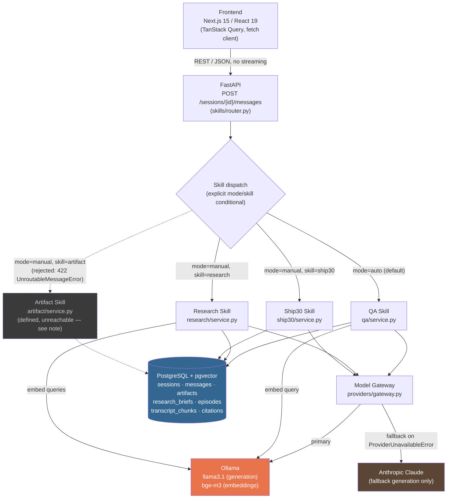
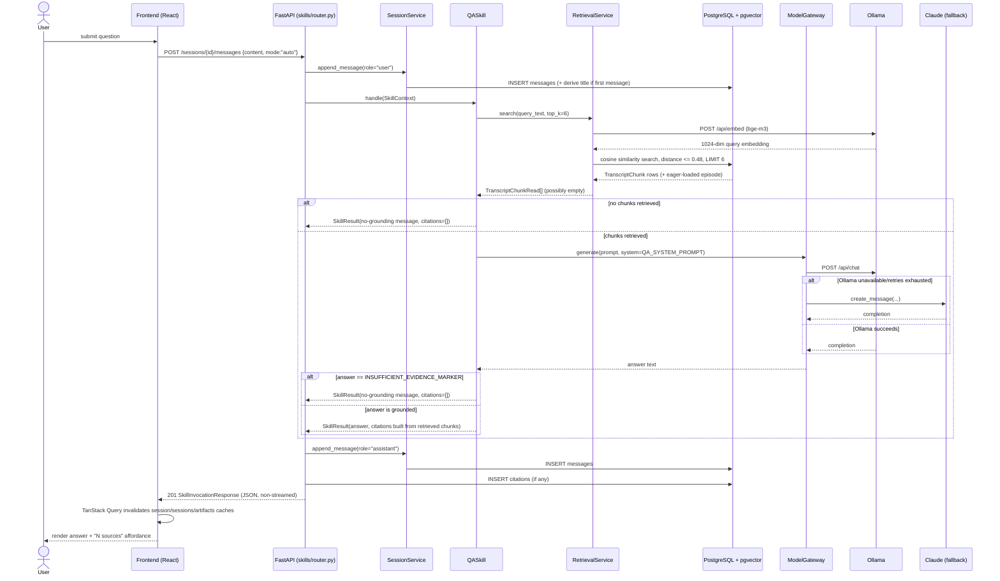
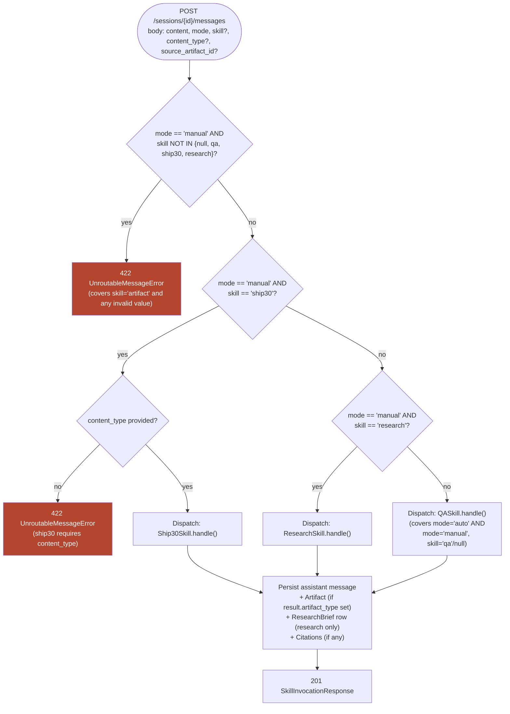
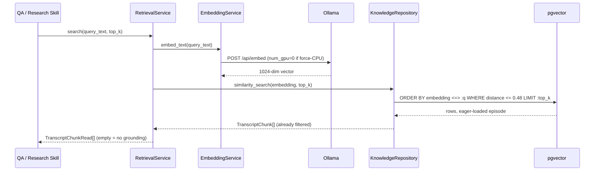
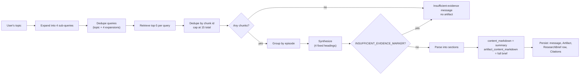
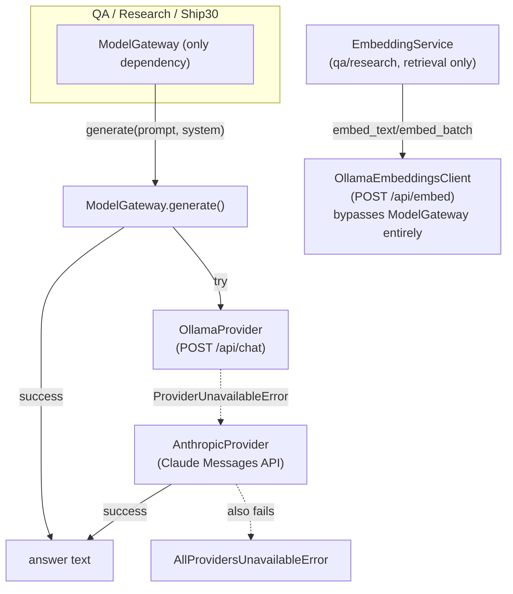
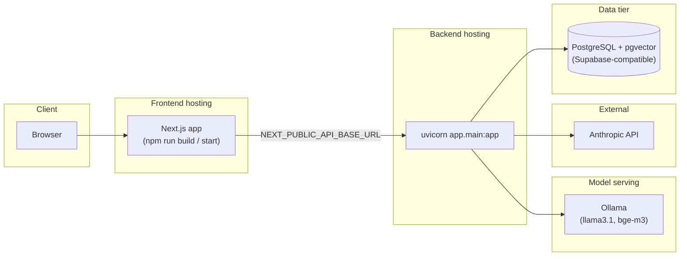

# Architecture Document

## Lenny Growth Assistant

| | |
|---|---|
| **Status** | As-built (verified against source) |
| **Version** | 2.0 |
| **Owner** | Engineering |
| **Last Updated** | 2026-08-03 |

Related: [PRD.md](./PRD.md) · [DOMAIN_MODEL.md](./DOMAIN_MODEL.md) · [DATABASE_SCHEMA.md](./DATABASE_SCHEMA.md) · [REPOSITORY_STRUCTURE.md](./REPOSITORY_STRUCTURE.md)

> **Provenance note.** This document supersedes the earlier draft of the same name. That draft was written *before* implementation and described several capabilities (SSE streaming, an intent-classifying auto-router, a full `(auth)` login UI) that were never built, or were built differently than planned. Every claim below was verified against the actual source in this repository — file paths are cited throughout so any statement here can be checked directly against the code it describes. Where the running system deliberately diverges from the earlier plan, this document says so explicitly rather than silently reconciling the two.

---

## Table of Contents

- [System Overview](#system-overview)
- [Architectural Principles](#architectural-principles)
- [High-Level Architecture](#high-level-architecture)
- [Request Lifecycle](#request-lifecycle)
- [Frontend Architecture](#frontend-architecture)
- [Backend Architecture](#backend-architecture)
- [Agentic Architecture](#agentic-architecture)
- [Retrieval Architecture](#retrieval-architecture)
- [Research Architecture](#research-architecture)
- [Artifact Architecture](#artifact-architecture)
- [Database Architecture](#database-architecture)
- [API Architecture](#api-architecture)
- [Provider Architecture](#provider-architecture)
- [LLM Toggle Architecture](#llm-toggle-architecture)
- [Security Considerations](#security-considerations)
- [Performance Optimizations](#performance-optimizations)
- [Deployment Architecture](#deployment-architecture)
- [Scaling Considerations](#scaling-considerations)
- [Future Architecture Improvements](#future-architecture-improvements)

---

## System Overview

Lenny Growth Assistant is a session-based RAG workspace with a Next.js 15 frontend and a FastAPI backend organized as **Vertical Slice Architecture** — each domain under `backend/app/domains/` (`auth`, `sessions`, `skills`, `knowledge`, `artifacts`, `providers`) owns its own routes, schemas, business logic, and data access, rather than the app being split into horizontal controller/service/repository layers. A single HTTP endpoint, `POST /sessions/{session_id}/messages`, is the entry point for all three working capabilities — QA, Research, and Ship30 content generation — dispatched by an explicit, deterministic conditional (not a classifier) in `skills/router.py`. Retrieval runs against PostgreSQL with the `pgvector` extension, embedding both the corpus (offline, at ingestion time) and each query (online, per request) with `bge-m3` served through Ollama. Generation prefers a locally-served `llama3.1` (also via Ollama) and automatically falls back to Anthropic Claude if Ollama is unavailable.

## Architectural Principles

1. **Vertical slices, not horizontal layers.** A domain folder is a complete, independently-testable unit — router, service, repository, models, schemas, exceptions, tests — identified by folder path, not by a domain-prefixed filename (`sessions/service.py`, never `session_service.py`).
2. **Structural typing over inheritance for pluggable behavior.** Both `skills/base.py::Skill` and `providers/base.py::ModelProvider` are `typing.Protocol`s. A new skill or provider only needs to satisfy the right method shape — no base class to extend, no shared mutable state to inherit.
3. **Constructor injection everywhere, wired through FastAPI `Depends()`.** Every service/skill/provider receives its collaborators through its constructor. There is no service locator and no module-level singleton besides the cached `Settings` object. This is what makes the backend's integration tests (`backend/tests/integration/`) able to exercise the real app and real orchestration logic with fakes substituted only at the database and model-provider boundaries.
4. **Citations are structural facts, never model output.** A citation can only exist for a chunk that was actually retrieved and shown to the model for that specific request (`skills/qa/citation_builder.py::CitationBuilder`) — never parsed out of the model's free-text response. This is enforced by construction, not by a post-hoc validation pass.
5. **Grounding is enforced twice, at two different layers.** A retrieval-time distance threshold (`knowledge/repository.py`) and a generation-time model self-check (a shared sentinel string, `INSUFFICIENT_EVIDENCE_MARKER`) are independent gates — neither alone is trusted to catch every ungrounded-answer case.
6. **The model layer is one abstraction away from every skill.** No skill imports `OllamaProvider` or `AnthropicProvider` directly — every skill depends on `providers.gateway.ModelGateway`, which owns the primary→fallback policy in exactly one place.
7. **Markdown is the only canonical artifact representation.** `artifacts.content_markdown` is the single source of truth; HTML is always a derived, sanitized read-time view (`artifacts/renderers/html_renderer.py`) — there is no `content_html` column to drift out of sync.

## High-Level Architecture



This is the requested `Frontend → FastAPI → Skill Router → {QA, Research, Artifact} Skill → Providers → {Ollama, Postgres/pgvector}` flow, drawn against the actual code: **Ship30 Skill is included because it is a real, fully working third skill** the simplified flow implies but doesn't name, and **the Artifact Skill is drawn with a dashed border because it exists in code (wired into dependency injection, satisfies the `Skill` protocol) but is not reachable through the API** — its `handle()` raises `NotImplementedError`, and `skills/router.py`'s `_IMPLEMENTED_SKILLS = ("qa", "ship30", "research")` explicitly excludes it. This is documented as fact, not as a criticism — see [Agentic Architecture](#agentic-architecture) for the full explanation.

## Request Lifecycle

End-to-end trace of a single Ask (QA) request:



Research and Ship30 follow the same envelope (persist user message → dispatch to skill → persist assistant message → persist artifact if any → persist citations if any → return JSON) with different internal skill logic — see [Research Architecture](#research-architecture) and [Artifact Architecture](#artifact-architecture).

## Frontend Architecture

**Stack**: Next.js 15.1.6 (App Router) · React 19 · TypeScript · Tailwind CSS · TanStack Query v5 · `react-markdown`.

### Routes

```
frontend/app/
├── layout.tsx                      # Root layout: fonts, <Providers> (QueryClientProvider)
├── page.tsx                         # "/" — Hero Landing Page (components/marketing/hero-landing.tsx)
└── (workspace)/                     # Route group — shares a layout, excluded from the URL
    ├── layout.tsx                   # 3-pane shell: SessionSidebar | children | RightPanel
    └── sessions/
        ├── page.tsx                 # "/sessions" — "select a session" empty state
        └── [sessionId]/
            └── page.tsx             # "/sessions/{id}" — the chat page for one session
```

`/` is a real, rendered page — not a redirect — and the workspace's own header logo is a `next/link` back to it, making navigation between the two symmetric. `(workspace)` groups the shared three-pane layout without adding a path segment.

### Components (by area)

| Area | Components | Responsibility |
|---|---|---|
| `components/marketing/` | `hero-landing.tsx` | The `/` landing experience: logo, headline, description, CTA, capability grid. |
| `components/sessions/` | `session-sidebar.tsx`, `session-list-item.tsx`, `new-session-button.tsx` | Session navigation: list (recency-ordered), create, switch. |
| `components/chat/` | `chat-input.tsx`, `message-list.tsx`, `message-bubble.tsx`, `empty-state.tsx` | The composer (Ask/Research toggle), message history rendering, the loading indicator. |
| `components/citations/` | `sources-tab.tsx`, `citation-card.tsx` | The Sources tab and its per-citation cards (episode, timestamp, quoted excerpt). |
| `components/artifacts/` | `artifacts-tab.tsx`, `artifacts-list.tsx`, `artifact-list-item.tsx`, `artifact-detail.tsx`, `ship30-actions.tsx` | Artifact listing/filtering, detail view (Markdown render + download), Ship30 generation controls. |
| `components/research/` | `research-tab.tsx`, `research-brief-list-item.tsx` | The Research tab (a filtered view of the same artifact list) and its title/summary/source-count row presentation. |
| `components/right-panel/` | `right-panel.tsx` | The tabbed shell (Sources / Artifacts / Research) wrapping the three tabs above. |
| `components/ui/` | `button.tsx`, `tabs.tsx`, `scroll-area.tsx`, `badge.tsx`, `avatar.tsx`, `skeleton.tsx`, `separator.tsx`, `textarea.tsx` | shadcn/ui primitives — unedited beyond the project's own theme tokens. |

### State management

Two clean layers, no third:

- **Server state** — every fact the backend owns (session list, session detail, artifacts) is owned by **TanStack Query**, keyed by `sessionsQueryKey`, `sessionQueryKey(id)`, `artifactsQueryKey(id)` (`hooks/use-sessions.ts`, `use-session.ts`, `use-artifacts.ts`). Sending a message (`hooks/use-send-message.ts`) invalidates all three in one `onSuccess`, since a message can change the session's title/recency, its history, and (for Research/Ship30) its artifact list.
- **UI-only cross-tree state** — which right-panel tab is active, and which message's citations the Sources tab shows — lives in `RightPanelProvider` (`hooks/use-right-panel.tsx`), a plain React Context. This exists specifically because the chat page and `<RightPanel />` are **siblings**, not parent/child, in the `(workspace)/layout.tsx` tree.

### Workspace

The three-pane shell (`(workspace)/layout.tsx`): a fixed 256px sidebar, a flexible (`min-w-0 flex-1`) chat column, and a fixed 450px right panel. See `docs/DATABASE_SCHEMA.md`-adjacent `design.md` for the full UX rationale; architecturally, the fixed-width panels are plain Tailwind width utilities, and the flexible center column is what actually benefits from additional monitor width.

## Backend Architecture

```
backend/app/
├── main.py                    # create_app(): CORS, exception handlers, router registration, /health, DEV_AUTH_BYPASS seed
├── config/settings.py         # One pydantic-settings Settings object, cached via lru_cache, injected via Depends(get_settings)
├── database/                  # SQLAlchemy async engine/session factory, declarative Base, Alembic migrations
├── exceptions/                # AppError hierarchy + FastAPI exception-handler registration
└── domains/
    ├── auth/                  # register/login/logout/reset — stubbed; DEV_AUTH_BYPASS is the real path
    ├── sessions/               # Session + Message CRUD, history, + artifact read-routes (delegated)
    ├── skills/                 # THE chat entry point: router.py + qa/, research/, ship30/, artifact/
    ├── knowledge/              # Ingestion + retrieval — internal only, no HTTP router
    ├── artifacts/              # Persistence + Markdown/HTML rendering — internal only, no HTTP router
    └── providers/              # ModelGateway: Ollama (primary) + Anthropic (fallback)
```

### Routers

Only three domains expose HTTP routes (`main.py`'s `create_app()`):

| Router | Prefix | Endpoints |
|---|---|---|
| `auth/router.py` | `/auth` | `POST /register`, `/login`, `/logout`, `/password-reset/request`, `/password-reset/confirm` — all wired, all `NotImplementedError` beneath the route. |
| `sessions/router.py` | `/sessions` | `POST /`, `GET /`, `GET /{id}`, plus artifact read-access (`GET /{id}/artifacts`, `GET /{id}/artifacts/{artifact_id}`, `GET /{id}/artifacts/{artifact_id}/download`) — delegated to `artifacts/service.py` since `artifacts/` has no router of its own. |
| `skills/router.py` | `/sessions` | `POST /{id}/messages` — the sole entry point for QA, Research, and Ship30. |

`knowledge/` and `artifacts/` are deliberately **internal-only domains** — no `router.py` exists in either. `knowledge` is reached exclusively via in-process calls from `qa/service.py` and `research/service.py`; `artifacts` is reached exclusively through `sessions/router.py`, since an artifact is never meaningfully accessed independent of its owning session.

### Services

Each domain's `service.py` holds orchestration/business logic and depends on that domain's own `repository.py` — never SQL directly, never another domain's repository. Representative examples:

- `sessions/service.py::SessionService` — session lifecycle: creation, ownership checks (`get_owned_session`, `get_session_with_history` — both raise the same `SessionNotFoundError` whether a session doesn't exist or belongs to someone else, deliberately not distinguishing the two to avoid an IDOR-style existence leak), title derivation from the first message, message appending.
- `artifacts/service.py::ArtifactService` — artifact CRUD, `get_markdown_for_download` (verbatim `content_markdown`), `get_html_for_session` (sanitized render via `renderers/html_renderer.py`).
- `skills/qa/service.py::QASkill`, `skills/research/service.py::ResearchSkill`, `skills/ship30/service.py::Ship30Skill`, `skills/artifact/service.py::ArtifactSkill` — one per skill, each satisfying `skills/base.py::Skill` structurally.

### Repositories

The only layer per domain that touches SQLAlchemy/`AsyncSession` directly. Convention held consistently: `add()`/`flush()` only, **never** `commit()`/`rollback()` — that's `database/session.py`'s `get_db` FastAPI dependency's job, so a whole request commits or rolls back atomically as one unit. `knowledge/repository.py::KnowledgeRepository.similarity_search` is the one repository method doing more than simple CRUD — it builds and executes the cosine-distance query directly (see [Retrieval Architecture](#retrieval-architecture)).

### Providers

`providers/base.py::ModelProvider` — a structural `Protocol` (`generate`, `stream`, `embed`) implemented independently by `providers/ollama/generation.py::OllamaProvider` and `providers/anthropic/generation.py::AnthropicProvider`. `providers/gateway.py::ModelGateway` is the only thing any skill depends on. See [Provider Architecture](#provider-architecture).

### Dependency injection

Every non-trivial object in the request path is constructed by a `get_*` provider function and wired through FastAPI's `Depends()` graph — never instantiated ad hoc inside a route body. A representative chain (`skills/dependencies.py`):

```python
def get_qa_skill(
    retrieval_service: RetrievalService = Depends(get_retrieval_service),
    model_gateway: ModelGateway = Depends(get_model_gateway),
) -> QASkill:
    return QASkill(retrieval_service=retrieval_service, model_gateway=model_gateway, citation_builder=CitationBuilder())
```

This is what lets `backend/tests/conftest.py` substitute a `FakeAsyncSession` and fake `RetrievalService`/`ModelGateway` objects via `app.dependency_overrides`, exercising the real FastAPI app, real routing, and real skill orchestration end-to-end with no live Postgres, Ollama, or Anthropic connection required for the test suite to run.

## Agentic Architecture

### Skill Router

There are, confusingly, **two** things named "router" in this codebase, and only one of them does what the name implies:

- **`skills/router.py`** — the actual FastAPI route handler for `POST /sessions/{id}/messages`. This is where dispatch genuinely happens, via a plain explicit conditional:

```python
use_ship30 = data.mode == "manual" and data.skill == "ship30"
use_research = data.mode == "manual" and data.skill == "research"
skill: Skill = ship30_skill if use_ship30 else research_skill if use_research else qa_skill
```

- **`skills/skill_router.py::SkillRouter`** — a separate class implementing an intent-classification "engine" (`_resolve_skill_type`, `_classify`, structured routing-decision logging). **It is not imported or called anywhere in the request path.** Its `_classify` method raises `NotImplementedError` if it were ever invoked. It exists in the codebase, fully wired for dependency injection in principle, but is dead code today.

This document treats `skills/router.py`'s conditional as *the* Skill Router for architectural purposes, since it's what actually executes, and documents `skill_router.py` as a designed-but-unused alternative implementation — not as a second active routing path.

### QA Skill

`skills/qa/service.py::QASkill.handle()`:

1. Retrieve top-6 chunks (`RetrievalService.search(top_k=6)`).
2. If retrieval is empty → return the fixed no-grounding message, zero citations, no model call.
3. Build a numbered-excerpt prompt (`qa/prompts.py::build_qa_prompt`) and call `ModelGateway.generate()` with `QA_SYSTEM_PROMPT`.
4. If the completion is exactly `INSUFFICIENT_EVIDENCE_MARKER` → same no-grounding message (second grounding gate).
5. Otherwise, build one `CitationRef` per retrieved chunk (`CitationBuilder`, never parsed from model text) and return the answer.

### Research Skill

`skills/research/service.py::ResearchSkill.handle()` — see [Research Architecture](#research-architecture) for the full pipeline. Architecturally distinct from QA in three ways: it issues *multiple* retrieval calls (one per expanded sub-query), it deduplicates across all of them before generation, and it produces **two** different Markdown bodies from one synthesis pass (a short chat summary and a full artifact body) rather than one shared string.

### Artifact Skill

`skills/artifact/service.py::ArtifactSkill` — satisfies the `Skill` protocol, is wired into `skills/dependencies.py::get_artifact_skill`, and is registered in `skill_router.py`'s (unused) registry. Its `handle()` method is a single line: `raise NotImplementedError`. It is additionally excluded from `skills/router.py`'s `_IMPLEMENTED_SKILLS = ("qa", "ship30", "research")`, so a client attempting `mode="manual", skill="artifact"` receives a `422 UnroutableMessageError` before this class is ever reached. It exists as a placeholder for a future, distinct capability — "perform an explicit artifact operation on prior content, independent of new retrieval" — that has not been designed or built.

*(Ship30 Skill, while not named in the requested four-skill list above, is documented in full in [Artifact Architecture](#artifact-architecture) as it is the third fully-working skill in the running system.)*

### Routing Logic



There is **no confidence-scored classification step** in the running system — every path through this diagram is a deterministic function of the request body alone. "Auto" mode is a fixed alias for QA, not an inference over the message content.

## Retrieval Architecture

### Embeddings

`knowledge/embeddings/embedding_service.py::EmbeddingService` calls `providers/ollama/embeddings.py::OllamaEmbeddingsClient` **directly** — deliberately bypassing `ModelGateway`, because embeddings have no Claude-equivalent fallback in this architecture (`AnthropicProvider.embed()` raises `NotImplementedError`). Model: **`bge-m3`**, 1024-dimensional dense output, called via Ollama's batch-capable `POST /api/embed`. Every returned vector's length is validated against `EMBEDDING_DIMENSION = 1024` (`knowledge/models.py`) before it can reach the database.

### Vector search

`knowledge/repository.py::KnowledgeRepository.similarity_search`:

```python
distance_expr = TranscriptChunk.embedding.cosine_distance(query_embedding)
stmt = (
    select(TranscriptChunk, distance_expr.label("distance"))
    .options(selectinload(TranscriptChunk.episode))
    .where(distance_expr <= _MAX_COSINE_DISTANCE)   # 0.48
    .order_by(distance_expr)
    .limit(top_k)
)
```

Backed by an **HNSW** index on `transcript_chunks.embedding` (`vector_cosine_ops`, `m=16, ef_construction=64`), chosen over IVFFlat specifically because it requires no pre-chosen `lists` parameter tied to an initial row-count estimate.

### Thresholds

`_MAX_COSINE_DISTANCE = 0.48` is the single most load-bearing constant in the retrieval path. An unbounded `ORDER BY ... LIMIT k` always returns exactly `k` rows regardless of actual relevance — which is what previously let an off-topic query retrieve the closest-available-but-still-irrelevant chunks and answer confidently from them. The value comes from empirically sampling real queries against the corpus: genuinely on-topic chunks landed at cosine distance ~0.34–0.48; a topically-adjacent-but-uncovered query landed at ~0.49–0.54; a fully unrelated query at ~0.62–0.68. `0.48` sits in the gap between the first two clusters, from a single-episode sample — documented in the code as a first cut to revisit as ingestion coverage grows, not a permanent constant.

### Citations

`skills/qa/citation_builder.py::CitationBuilder.build()` maps retrieved chunks to `CitationRef`s **one-to-one, in retrieval order** — never parsed from the model's answer text. `_format_label` produces the display string (`"Episode 142 — 12:34-13:02"`) from `episode.title` plus the chunk's `start_timestamp_seconds`/`end_timestamp_seconds`. This guarantees a citation can only exist for content the model actually saw.



## Research Architecture

### Query expansion

`research/prompts.py::build_query_expansion_prompt` asks the model for **4 distinct sub-queries** covering different angles of the topic (`_NUM_SUBQUERIES = 4`), one per line. `parse_subqueries` strips any numbering/bullets the model added anyway.

### Retrieval

The original topic plus its 4 expansions are deduplicated (case-insensitive) into a query set; each query independently retrieves its own top-5 chunks (`_TOP_K_PER_QUERY = 5`). Results are merged and deduplicated **by `transcript_chunk.id` across all queries**, capped at **15 total chunks** (`_MAX_TOTAL_CHUNKS`).

### Synthesis

Chunks are grouped by episode and handed to `RESEARCH_SYSTEM_PROMPT`, which mandates exactly four fixed Markdown headings (`## Executive Summary`, `## Key Insights`, `## Supporting Evidence`, `## Recommended Actions`) and explicitly forbids the model from writing its own citations section. `ResearchSynthesizer.structure()` parses the completion by its `## ` headings, falling back to one catch-all section if the model didn't use headings at all.

### Artifact persistence

`ResearchSkill.handle()` produces **two distinct Markdown strings** from one synthesis pass:

- `content_markdown` → persisted onto the **assistant chat message**: title + executive summary + a pointer to the Research tab.
- `artifact_content_markdown` → persisted onto the **Artifact**: the complete four-section brief plus a programmatically-appended Citations section built from the same `citations` list used for the DB rows.

`skills/router.py` reads `result.artifact_content_markdown or result.content_markdown` when creating the `Artifact` row — every other skill leaves `artifact_content_markdown` unset, so this fallback is a no-op for QA/Ship30 and only actually diverges for Research. When `artifact_type == "research_brief"`, the router additionally persists a `ResearchBrief` specialization row (`topic`, `summary`) via `artifact_service.create_research_brief`.



## Artifact Architecture

"Artifact Generation" in this codebase is the **Ship30 Skill** (`skills/ship30/service.py::Ship30Skill`) — there is no separate generation endpoint; it runs through the same `POST /sessions/{id}/messages` path (`mode="manual", skill="ship30"`).

### Transformations

**Source resolution** (`_resolve_source_markdown`), in priority order: (1) an explicit `source_artifact_id` — its `content_markdown` is the source; (2) the most recent assistant message in the session; (3) the user's own instruction text, if there's no prior history at all.

### Content generation

One shared system prompt (`SHIP30_SYSTEM_PROMPT`) plus per-format guidance (`_FORMAT_GUIDANCE`), then per-format post-processing:

| Format | Post-processing |
|---|---|
| `linkedin_post` | Hard-truncated at **3000 characters** (`format_linkedin_post`) — LinkedIn's real limit; a safety net since the prompt already targets ~150–300 words. |
| `x_thread` | Split on blank lines (`format_x_thread`); any segment still over **280 characters** is word-wrapped, never mid-word; rendered as a numbered `**N/M**` Markdown document (`render_x_thread_markdown`). |
| `article` | If the model omits a leading `# Title`, the first line is promoted into one (`format_article`) rather than the output being rejected. |

The formatted result becomes both a new `Artifact` (`artifact_type` = the same `content_type`) and a new assistant chat message — identical persistence shape to QA and Research.

## Database Architecture

Schema is defined in one consolidated Alembic migration, `backend/app/database/migrations/versions/0001_initial_schema.py` (raw SQL via `op.execute`, for triggers/RLS that have no native Alembic DSL). `auth.users` is Supabase's own table, not created by this schema.

```mermaid
erDiagram
    AUTH_USERS ||--o| PROFILES : "extends"
    AUTH_USERS ||--o{ SESSIONS : owns
    SESSIONS ||--o{ MESSAGES : contains
    SESSIONS ||--o{ ARTIFACTS : "has attached"
    MESSAGES ||--o{ ARTIFACTS : produces
    MESSAGES ||--o{ CITATIONS : cites
    CITATIONS }o--|| TRANSCRIPT_CHUNKS : references
    TRANSCRIPT_CHUNKS }o--|| EPISODES : "belongs to"
    ARTIFACTS ||--o| RESEARCH_BRIEFS : "specializes (1:1)"

    SESSIONS {
        uuid id PK
        uuid user_id FK
        text title
        timestamptz created_at
        timestamptz updated_at "bumped by trigger on new message"
    }
    MESSAGES {
        uuid id PK
        uuid session_id FK
        text role "user | assistant | system"
        text content
        text skill_used "qa|research|ship30|artifact, nullable"
        timestamptz created_at
    }
    ARTIFACTS {
        uuid id PK
        uuid session_id FK
        uuid message_id FK
        text artifact_type "qa_answer|research_brief|linkedin_post|x_thread|article"
        text content_markdown "canonical, no content_html column"
        timestamptz created_at
    }
    RESEARCH_BRIEFS {
        uuid id PK
        uuid artifact_id FK_UK "1:1 via UNIQUE"
        text topic
        text summary
    }
    TRANSCRIPT_CHUNKS {
        uuid id PK
        uuid episode_id FK
        text content
        vector_1024 embedding "HNSW cosine index"
        int start_offset
        int end_offset
        int start_timestamp_seconds
        int end_timestamp_seconds
    }
    CITATIONS {
        uuid id PK
        uuid message_id FK
        uuid transcript_chunk_id FK "ON DELETE RESTRICT"
        text display_label
    }
    EPISODES {
        uuid id PK
        text title
        text guest_name
        date published_at
        text source_url
    }
```

### Relationships explained

- **`sessions` → `messages`** (1:N, `CASCADE`): a message has no meaning outside its session; deleting a session deletes its messages.
- **`sessions` → `artifacts`** (1:N, `CASCADE`) and **`messages` → `artifacts`** (1:N, `CASCADE`): every artifact is doubly scoped — to the session it belongs to *and* the specific message that produced it (`skills/router.py` step 7 sets both on creation).
- **`messages` → `citations`** (1:N, `CASCADE`): a citation is meaningless without the claim it grounds.
- **`transcript_chunks` → `citations`** (1:N, **`RESTRICT`**, not `CASCADE`): the one deliberately non-cascading relationship in the schema — protects historical grounding data from being silently orphaned if a future re-ingestion deletes or replaces a cited chunk. The ingestion pipeline currently avoids this entirely by never deleting existing chunks (`IngestionPipeline.ingest_episode` always inserts a *new* episode row rather than replacing one).
- **`episodes` → `transcript_chunks`** (1:N, `CASCADE`): populated exclusively by the offline ingestion pipeline; read-only at request time.
- **`artifacts` → `research_briefs`** (1:1, `CASCADE`, enforced `UNIQUE`): a specialization row, not a subtype table — it exists only for artifacts where `artifact_type = 'research_brief'`, enforced by a `BEFORE INSERT/UPDATE` trigger (`enforce_research_brief_artifact_type`) since a cross-table constraint isn't expressible as a plain `CHECK`.
- **`auth.users` → `profiles`** (1:1, shared PK): `profiles.id` **is** `auth.users.id`, not an independently generated UUID; auto-created by a `handle_new_user()` trigger on `auth.users` insert.

Indexes: `(user_id, updated_at DESC)` on `sessions` (sidebar ordering) · `(session_id, created_at)` on `messages` and `artifacts` · `(message_id)` on `artifacts` · `(episode_id)` on `transcript_chunks` · `(transcript_chunk_id)` on `citations` · the HNSW vector index described above. `RoutingDecision` and `ModelInvocation` (both documented conceptual entities in `DOMAIN_MODEL.md`) have **no corresponding tables** — both are log-only (see [Agentic Architecture](#agentic-architecture) and `providers/gateway.py::_log_invocation`).

## API Architecture

Base URL: `http://localhost:8000`, no versioning prefix. Every error response is `{"error_code": string, "message": string}` (`exceptions/handlers.py`), mapped from an `AppError` subclass (404/`not_found`, 422/`validation_error`, 401/`unauthorized`, 403/`forbidden`, 409/`conflict`, 502/`upstream_service_error`).

| Method & Path | Domain | Purpose |
|---|---|---|
| `GET /health` | — | Liveness probe, no dependency checks. |
| `POST /auth/register`, `/login`, `/logout`, `/password-reset/request`, `/password-reset/confirm` | `auth` | Defined, routed, all `NotImplementedError` beneath the handler. |
| `POST /sessions` | `sessions` | Create a session. |
| `GET /sessions` | `sessions` | List the caller's sessions, most-recent first. |
| `GET /sessions/{id}` | `sessions` | Resume a session with full ordered history. |
| `GET /sessions/{id}/artifacts` | `sessions` (delegates to `artifacts`) | List a session's artifacts. |
| `GET /sessions/{id}/artifacts/{artifact_id}` | `sessions` (delegates to `artifacts`) | Get one artifact. |
| `GET /sessions/{id}/artifacts/{artifact_id}/download` | `sessions` (delegates to `artifacts`) | Raw Markdown, `PlainTextResponse`. |
| `POST /sessions/{id}/messages` | `skills` | QA / Research / Ship30 dispatch — see [Agentic Architecture](#agentic-architecture). |

**Example — Ask (auto mode):**
```bash
curl -X POST http://localhost:8000/sessions/{id}/messages \
  -H "Content-Type: application/json" \
  -d '{"content": "What is activation?"}'
```
```json
{
  "skill_used": "qa",
  "routing_mode": "auto",
  "message": {"role": "assistant", "content": "Activation means getting to value fast [1].", "citations": [...]},
  "citations": [{"transcript_chunk_id": "…", "display_label": "Episode 142 — 1:40-1:50", "excerpt": "…"}],
  "artifact_id": null
}
```

**Example — Ship30 from an existing artifact:**
```bash
curl -X POST http://localhost:8000/sessions/{id}/messages \
  -H "Content-Type: application/json" \
  -d '{"content": "Make it punchy.", "mode": "manual", "skill": "ship30",
       "content_type": "linkedin_post", "source_artifact_id": "…"}'
```

## Provider Architecture



`providers/ollama/client.py::OllamaClient` is the shared HTTP transport under both Ollama call sites (generation and embeddings) — it owns pooled connections, timeout enforcement, and bounded retry (3 attempts, exponential backoff from 0.5s) on transient failures (`408/425/429/500/502/503/504`, connection errors, timeouts). Non-retryable statuses (400, 404, 401/403) fail immediately. `ModelGateway` only sees a failure after this retry budget is exhausted — a fallback to Claude happens after Ollama has had a genuine, bounded chance, not on the first hiccup.

Embeddings are **not** routed through `ModelGateway` at all — `EmbeddingService` calls `OllamaEmbeddingsClient` directly, since `AnthropicProvider.embed()` is `NotImplementedError` (no Claude-embedding equivalent exists in this architecture).

## LLM Toggle Architecture

There is **no user-facing or request-level toggle** to manually select a model provider — no "use Claude instead" switch exists anywhere in the API or UI. What actually exists, and what an extension would build on:

**Implemented today:**
1. **Automatic failover, not a manual toggle** — `ModelGateway.generate()` always tries Ollama first and falls back to Claude only on `ProviderUnavailableError`, transparently, per-request. This is a reliability mechanism, not a feature a caller can invert.
2. **Configuration-level model selection** — `OLLAMA_GENERATION_MODEL`, `OLLAMA_EMBEDDING_MODEL`, and `ANTHROPIC_MODEL` (`config/settings.py`) let an operator change *which* model each provider uses via environment variables, with no code change — this is the closest thing to a "toggle" in the system today, and it is deploy-time, not runtime.
3. **A related, real runtime toggle**: `OLLAMA_EMBEDDING_FORCE_CPU` (default `true`) — a genuine per-request behavioral switch, controlling whether `OllamaEmbeddingsClient` sets `options.num_gpu = 0` on every embedding call. This is a resource-placement toggle, not a model-selection one, but it is the one place a boolean setting changes provider call behavior at request time.

**Extension path, if a manual provider toggle were built**: `ModelGateway`'s constructor already accepts `primary`/`secondary` as two independent `ModelProvider`-shaped objects (`providers/dependencies.py::get_model_gateway`). A manual toggle would most naturally be implemented as:
- A new field on `SkillInvocationRequest` (e.g., `provider: Literal["auto", "ollama", "claude"] | None`), threaded through `SkillContext`.
- `ModelGateway.generate()` gaining a parameter to skip the primary and call `self._secondary` directly when `provider == "claude"` is explicitly requested — a small, additive change, since both providers already satisfy the identical `ModelProvider` protocol and neither skill has any provider-specific logic to duplicate.
- No change would be required to any skill's own code (`qa/service.py`, `research/service.py`, `ship30/service.py`) — they already only ever call `self._model_gateway.generate(...)`, never a concrete provider.

## Security Considerations

- **Authentication is not production-ready.** `auth/service.py` is entirely `NotImplementedError`; the system runs via `DEV_AUTH_BYPASS=true`, which makes `auth/dependencies.py::get_current_user` return a fixed identity with **zero JWT validation**. This must never be enabled in an environment reachable by untrusted clients.
- **Ownership enforcement is application-layer, not RLS.** The backend connects to Postgres with the Supabase `service_role` key, which bypasses Row-Level Security for its own queries. Every domain's `service.py` re-derives and checks ownership explicitly (`SessionService.get_owned_session`, `ArtifactService.get_for_session`) — this is the actual security boundary today; the RLS policies defined in the migration are enabled but currently inert for backend-issued traffic (defense-in-depth for a hypothetical future direct-to-Postgres client, not the primary guarantee).
- **IDOR avoidance by design.** Both `get_owned_session` and `ArtifactService.get_for_session` return the identical `NotFoundError` whether a resource doesn't exist or belongs to a different user — deliberately not distinguishing the two, so a response can never be used to enumerate other users' valid resource ids.
- **HTML rendering is sanitized, not just converted.** `artifacts/renderers/html_renderer.py::render_html` runs `markdown.markdown()` (which passes inline HTML through untouched — a Markdown *feature*, not a safety guarantee) followed by `nh3.clean()` with an explicit tag/attribute/URL-scheme allowlist (`http`/`https`/`mailto` only) — the actual security boundary, stripping `<script>`, event-handler attributes, and `javascript:`/`data:` URLs.
- **Citations cannot be forged.** Because `CitationBuilder` only ever builds citations from chunks actually retrieved for the current request, there is no code path by which a citation could reference content the model was never shown.
- **`citations.transcript_chunk_id` uses `ON DELETE RESTRICT`.** A defensive constraint against a future re-ingestion silently invalidating historical grounding evidence behind an already-generated, already-cited answer.
- **Secrets are environment-only.** `Settings` (`pydantic-settings`) reads `DATABASE_URL`, `SUPABASE_*`, `ANTHROPIC_API_KEY` exclusively from the environment/`.env`; nothing is hardcoded, and `.env` is gitignored.

## Performance Optimizations

- **Retrieval distance threshold (`_MAX_COSINE_DISTANCE = 0.48`)** — see [Retrieval Architecture](#retrieval-architecture). Fixes a reproduced correctness problem (confidently-cited irrelevant chunks), not a speculative tuning knob.
- **Two-stage grounding enforcement** — the threshold above (pre-generation) plus the `INSUFFICIENT_EVIDENCE_MARKER` self-check (post-generation) in both `qa/service.py` and `research/service.py`. Neither stage alone catches every failure mode: the threshold can't tell "adjacent topic" from "on-topic," and a self-check alone can't stop a retrieval that returned nothing relevant to begin with.
- **`OLLAMA_EMBEDDING_FORCE_CPU=true` (model placement optimization)** — on a GPU too small to hold both the generation and embedding models resident simultaneously, switching between them (which every QA/Research request does — embed, then generate) evicted whichever model wasn't currently active, forcing a full reload on the next call to either. Measured: **~2.5s warm vs. ~14s reload** for `bge-m3`; **~3.3s warm vs. ~22s reload** for `llama3.1`. Forcing the small (566M-parameter) embedding model onto CPU via Ollama's per-request `options.num_gpu=0` leaves the GPU exclusively resident to the generation model — eliminating the thrash rather than merely reducing it.
- **Bounded retry with exponential backoff**, retryable-status-only (`OllamaClient`, 3 attempts, `0.5s * 2^n`) — a `400`/`404` fails immediately rather than wasting the retry budget on a request that can never succeed.
- **HNSW over IVFFlat** for the vector index — avoids a `lists` parameter tied to an initial row-count estimate that would degrade as the corpus grows past that estimate.

## Deployment Architecture



No container orchestration is used — `CONTEXT.md` explicitly rules out Docker for this build. Deployment is a plain process model: `uvicorn` serving the FastAPI app, `next start` (or a static/edge host) serving the built frontend, a reachable Postgres instance with `pgvector`/`pgcrypto` enabled, and a reachable Ollama instance. All inter-service configuration is environment-variable driven (`OLLAMA_BASE_URL`, `DATABASE_URL`, `NEXT_PUBLIC_API_BASE_URL`), so the same codebase runs unmodified across local, single-host, and split-host topologies.

## Scaling Considerations

- **Backend is stateless by design.** No session state lives in FastAPI process memory — everything is in Postgres — so multiple `uvicorn` instances behind a load balancer are interchangeable with no sticky-session requirement.
- **Retrieval scales via the vector index, not the corpus size.** HNSW keeps similarity search performant as `transcript_chunks` grows, independent of adding more episodes.
- **Ollama is a single-instance bottleneck today.** There is no connection pooling, queuing, or multi-instance load balancing in front of Ollama — under concurrent sessions, generation and embedding requests serialize against whatever the local Ollama process can actually process at once. The Claude fallback provides a release valve on *outright unavailability*, not on *saturation* (a slow-but-technically-healthy Ollama instance won't trigger failover).
- **`OLLAMA_EMBEDDING_FORCE_CPU` is itself a scaling tradeoff**, not a free win — it trades embedding latency (CPU is slower than GPU per-call) for eliminating cross-model eviction thrash; on hardware with enough VRAM for both models simultaneously, disabling it would very plausibly be faster, which is exactly why it's a config flag rather than a hardcoded behavior.
- **A single Postgres instance serves both transactional and vector workloads.** This keeps operational surface area small (one datastore, one backup/migration story) but means heavy retrieval load and heavy session/message write load share the same instance's resources — acceptable at this project's single-corpus scale, a real consideration at materially larger scale.
- **No caching layer exists** for repeated/similar QA queries — every Ask request re-embeds the query and re-runs similarity search, even for an identical or near-identical prior question.

## Future Architecture Improvements

- Decide the fate of `skills/skill_router.py::SkillRouter` — either implement its `_classify` intent-classification step for real, or remove the dead code path so the codebase has exactly one router, not two.
- Implement or retire `ArtifactSkill` — currently defined, wired, and unreachable; a deliberate placeholder that should not remain ambiguous indefinitely.
- Wire `ModelGateway.stream()` end-to-end (`OllamaProvider.stream()` and `AnthropicProvider.stream()` already exist and work in isolation) — including resolving the still-open streaming-failover question (what happens if the primary provider fails *mid-stream*, after already emitting partial output).
- Persist `RoutingDecision` and `ModelInvocation` as real tables once routing-quality evaluation or per-provider cost/latency analytics become a genuine product need — both are currently log-only by explicit, documented MVP-simplification decision.
- Add connection pooling/request queuing in front of Ollama, and consider a caching layer for repeated QA queries, before concurrent-session load becomes a real bottleneck.
- Add an `embedding_model`/version column to `transcript_chunks` before ever changing `OLLAMA_EMBEDDING_MODEL` in a live deployment, to make a future re-embed migration safe and trackable rather than a silent dimension mismatch.
- De-duplicate re-ingestion (`IngestionPipeline.ingest_episode` currently always creates a new `Episode` row per run against the same source file) — currently safe only because `citations.transcript_chunk_id` is `ON DELETE RESTRICT`, not because re-ingestion is idempotent.
- Revisit the `0.48` cosine-distance threshold once ingestion coverage is materially larger than the single-episode sample it was empirically tuned against.
- Finish real Supabase Auth (`auth/supabase_client.py`'s `sign_up`/`sign_in_with_password`/etc., and JWT verification in `auth/dependencies.py::get_current_user`) before any deployment reachable by untrusted clients.
