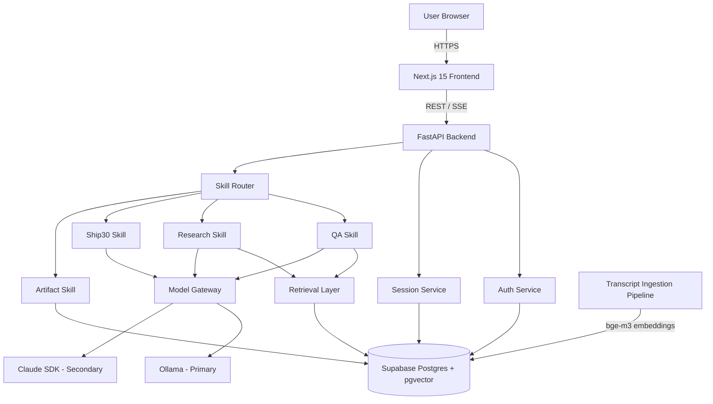
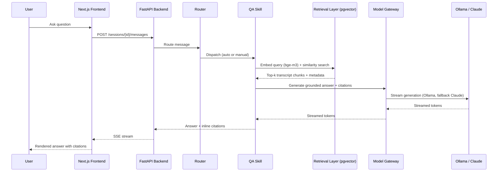
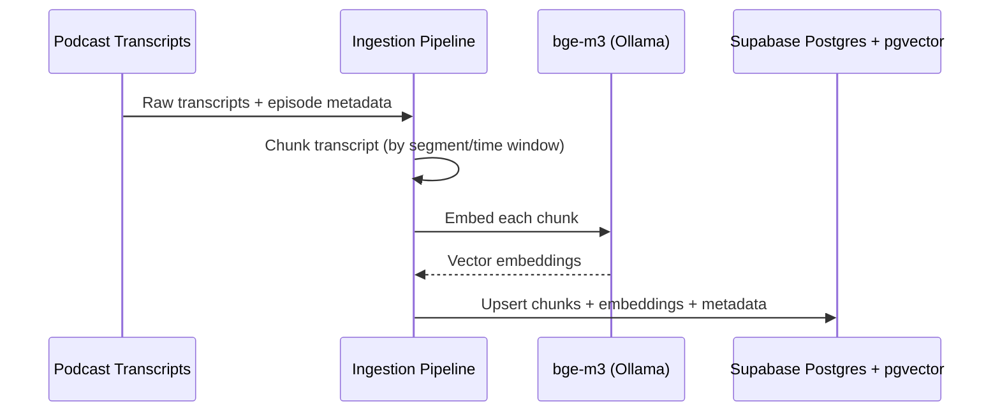
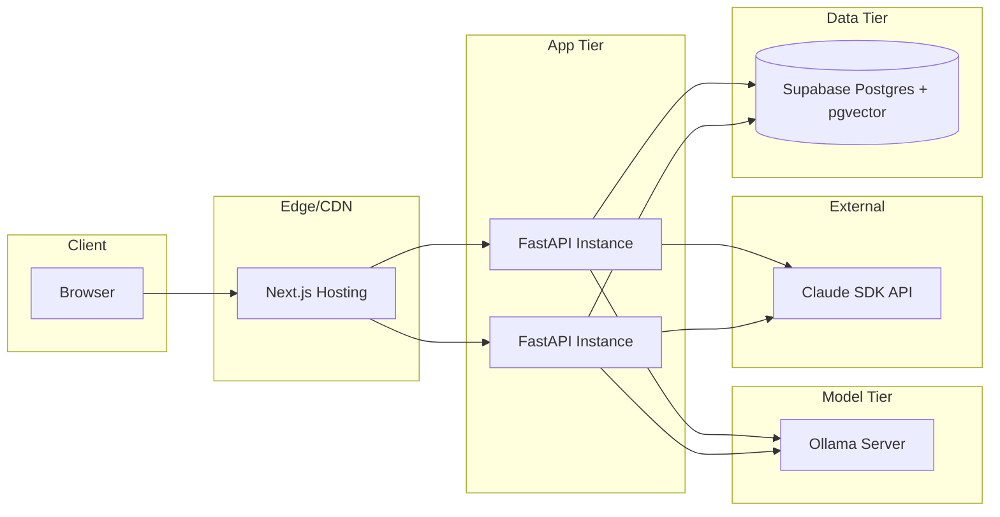

# Architecture: Lenny Growth Workspace

| | |
|---|---|
| **Status** | Draft |
| **Version** | 0.1.0 |
| **Owner** | Engineering |
| **Last Updated** | 2026-08-02 |

Related: [PRD.md](./PRD.md) · [DOMAIN_MODEL.md](./DOMAIN_MODEL.md) · [IMPLEMENTATION_PLAN.md](./IMPLEMENTATION_PLAN.md)

---

## 1. Overview

Lenny Growth Workspace is a session-based, skill-routed AI workspace. A Next.js frontend talks to a FastAPI backend, which routes each user message to one of four skills (QA, Research, Ship30, Artifact). Skills retrieve grounded context from a pgvector-backed Postgres store (Supabase) populated by a `bge-m3` embedding pipeline, and generate responses via a model layer that prefers a local Ollama model and falls back to the Claude SDK for graceful degradation.

## 2. System Context



## 3. High-Level Architecture

### 3.1 Frontend — Next.js 15 / TypeScript / Tailwind / shadcn/ui

- **App Router** structure with server components for initial session/auth data, client components for interactive chat, streaming, and the artifact panel.
- **Tailwind + shadcn/ui** for a consistent, accessible component system (chat bubbles, session sidebar, artifact viewer, skill selector).
- Responsibilities:
  - Auth flows (register/login/logout/reset) against backend REST endpoints.
  - Session sidebar: list, create, resume sessions.
  - Chat interface: streamed message rendering, citation display, skill indicator, manual skill override control.
  - Artifact panel: Markdown/HTML rendering, copy, download.
- Communicates with the backend via REST for CRUD-style operations and **Server-Sent Events (SSE)** (or streaming fetch) for token-streamed skill responses.

### 3.2 Backend — FastAPI

- Python service exposing REST + streaming endpoints, organized around bounded contexts:
  - `auth/` — registration, login, logout, password reset (JWT/session-token issuance).
  - `sessions/` — session CRUD, message history, artifact association.
  - `router/` — auto-routing classifier + manual override handling.
  - `skills/` — one module per skill (`qa/`, `research/`, `ship30/`, `artifact/`), each implementing a common `Skill` interface.
  - `retrieval/` — embedding query, pgvector similarity search, citation assembly.
  - `models/` — model gateway abstraction (Ollama primary, Claude SDK secondary).
- FastAPI chosen for async I/O (concurrent streaming to multiple clients), typed request/response models via Pydantic, and low-overhead integration with async DB drivers and HTTP model clients.

### 3.3 Database — Supabase PostgreSQL + pgvector

- Supabase provides managed Postgres, auth-adjacent primitives (can be used for or alongside custom auth), row-level security, and storage.
- **pgvector** extension stores transcript-chunk embeddings for semantic search, alongside relational tables for users, sessions, messages, artifacts, and citations.
- A single relational store (rather than a separate vector DB) keeps transactional data (sessions/messages) and retrieval data (embeddings) consistent and simplifies operations at this project's scale.
- Row-Level Security (RLS) policies enforce per-user isolation of sessions, messages, and artifacts at the database layer, in addition to application-layer checks.

### 3.4 Embeddings — bge-m3 via Ollama

- `bge-m3` is served locally through Ollama and used to embed both:
  - Transcript chunks at ingestion time (offline pipeline).
  - User queries at retrieval time (online, per QA/Research request).
- Chosen for strong multilingual/multi-granularity retrieval performance and the ability to run fully local, avoiding per-query embedding API costs and keeping podcast transcript data in-house.
- Embedding dimensionality and chunking strategy (see §5.1) are fixed at ingestion time; any change requires re-embedding the corpus.

### 3.5 Model Layer — Ollama (Primary) / Claude SDK (Secondary)

- A **Model Gateway** abstraction in the backend exposes a single interface (`generate`, `stream`) to all skills, decoupling skill logic from the underlying provider.
- **Primary path**: local Ollama-served model handles generation for cost control, latency, and data locality.
- **Secondary path**: Claude SDK is invoked when the primary path is unavailable, times out, or fails health checks — implementing **graceful degradation** rather than a hard failure surfaced to the user.
- Failover policy:
  1. Attempt Ollama with a bounded timeout.
  2. On failure/timeout/health-check failure, transparently retry via Claude SDK.
  3. Surface degraded-mode status to the frontend (e.g., a subtle indicator) without blocking the response.
  4. Log provider used per request for observability and cost tracking.

### 3.6 Sessions

- Sessions are the top-level unit of work: chat-based, ordered message history, with zero or more artifacts attached.
- Session sidebar (frontend) reflects session list from the backend, ordered by recency.
- Each message records which skill handled it and which model provider generated the response, enabling auditability and debugging.
- Continuing a session reloads full message history and artifact state, allowing multi-turn context to be reused by skills (e.g., a Research brief can be referenced by a subsequent Ship30 request in the same session).

### 3.7 Router

- The router sits between session/message intake and skill execution.
- **Auto routing**: a lightweight classification step (rule-based heuristics and/or a small model prompt) inspects the user message plus recent session context and selects one of `qa | research | ship30 | artifact`.
- **Manual override**: the frontend sends an explicit `skill` field when the user selects a skill directly; the router honors this without invoking the classifier.
- Routing decisions are persisted per-message for auditability and future routing-quality evaluation.

### 3.8 Skills

All skills implement a common interface so the router and session layer can treat them uniformly:

```
Skill.handle(session_context, user_message, model_gateway, retrieval_layer) -> SkillResult
```

- **QA Skill**: retrieval → grounded generation → inline citation assembly.
- **Research Skill**: multi-query retrieval across episodes → synthesis into a structured brief → citation assembly → artifact emission.
- **Ship30 Skill**: consumes prior session context (QA answers / Research briefs) → generates platform-specific content (LinkedIn post / X thread / article) → artifact emission.
- **Artifact Skill**: handles explicit artifact operations (e.g., "turn this into a document," format conversion) independent of new retrieval.

### 3.9 Artifact System

- Artifacts are structured outputs (Markdown source of truth) attached to the message/session that produced them.
- **Rendering**: Markdown is rendered client-side; an HTML rendering mode sanitizes and renders formatted HTML for richer preview (e.g., embedded citation links).
- **Copy**: copies the canonical Markdown to clipboard.
- **Download**: serves the canonical Markdown as a `.md` file download.
- Markdown is treated as the artifact's source of truth; HTML is a derived, sanitized view — this avoids divergence between what's copied/downloaded and what's rendered.

## 4. Data Flow

### 4.1 QA Request Flow



### 4.2 Ingestion Flow (offline)



## 5. Key Architecture Decisions

### ADR-1: Single Postgres instance (Supabase) for both relational and vector data
- **Decision**: Use Supabase Postgres with pgvector rather than a dedicated vector database.
- **Rationale**: Keeps transactional integrity between sessions/messages/artifacts and retrieval data; reduces operational surface area (one datastore, one backup/migration story); Supabase provides auth, RLS, and storage primitives useful across the product.
- **Trade-off**: pgvector may not match a specialized vector DB's raw ANN performance at very large scale; acceptable for a single-corpus (Lenny's Podcast) dataset size.

### ADR-2: Local-first model serving via Ollama with Claude SDK fallback
- **Decision**: Route generation and embedding calls to a locally-served Ollama model by default; fall back to the Claude SDK on failure/unavailability.
- **Rationale**: Cost control and data locality for the primary path; reliability via a hosted secondary path; avoids hard-coupling the product to a single provider's availability.
- **Trade-off**: Requires a Model Gateway abstraction and health-check/failover logic; response quality/latency may differ between providers, which must be made transparent to users.

### ADR-3: Skill-based architecture with a routing layer
- **Decision**: Structure backend capabilities as independent Skills behind a common interface, coordinated by a Router that supports both auto-classification and manual override.
- **Rationale**: Keeps QA, Research, Ship30, and Artifact logic decoupled and independently testable/extensible; manual override protects against router misclassification harming UX.
- **Trade-off**: Requires maintaining a classifier and its accuracy over time; mitigated by logging routing decisions for evaluation.

### ADR-4: Markdown as artifact source of truth
- **Decision**: All artifacts are authored/stored as Markdown; HTML is a derived, sanitized rendering.
- **Rationale**: Guarantees Copy/Download always match a single canonical representation; simplifies artifact diffing/versioning; Markdown is portable across downstream tools (CMS, notes apps).
- **Trade-off**: Rich HTML-only formatting is not supported; acceptable given target use cases (posts, threads, articles, briefs).

### ADR-5: FastAPI as the backend framework
- **Decision**: Use FastAPI over alternatives (Django, Flask, Node/Express).
- **Rationale**: Native async support suits streaming model responses and concurrent retrieval calls; Pydantic typing aligns with strict request/response contracts between frontend and skill layer; strong ecosystem fit with Python-based ML/embedding tooling.

## 6. Security Architecture

- **Authentication**: token-based sessions (JWT or Supabase-issued tokens) validated on every backend request.
- **Authorization**: per-user data isolation enforced at both the application layer (query scoping by `user_id`) and the database layer (Postgres RLS policies) on sessions, messages, and artifacts.
- **Password handling**: hashed with a strong adaptive algorithm (e.g., bcrypt/argon2); reset tokens are single-use and time-limited.
- **Input handling**: HTML artifact rendering is sanitized server- or client-side to prevent stored/reflected XSS.
- **Secrets**: Ollama endpoint config and Claude SDK API keys are managed via environment/secret store, never committed or exposed to the frontend.
- **Transport**: all client-server traffic over HTTPS/TLS.

## 7. Scalability & Performance Considerations

- **Retrieval**: pgvector indexes (e.g., HNSW/IVFFlat) on the embeddings table keep similarity search performant as the transcript corpus grows; retrieval is scoped with metadata filters (episode, date) where applicable to reduce search space.
- **Streaming**: SSE/streaming responses reduce perceived latency for long-generation skills (Research briefs, articles).
- **Model concurrency**: the Model Gateway should support connection pooling/queuing to Ollama to avoid resource contention under concurrent sessions; Claude SDK fallback provides a release valve under local-model saturation.
- **Stateless backend**: FastAPI instances are horizontally scalable behind a load balancer; session state lives in Postgres, not in-process memory, so instances are interchangeable.

## 8. Deployment Architecture (indicative)



## 9. Technology Stack Summary

| Layer | Technology | Purpose |
|---|---|---|
| Frontend framework | Next.js 15 | App routing, SSR/streaming UI |
| Frontend language | TypeScript | Type-safe client code |
| Styling | Tailwind CSS | Utility-first styling |
| Component library | shadcn/ui | Accessible, composable UI primitives |
| Backend framework | FastAPI | Async REST + streaming API |
| Database | Supabase PostgreSQL | Relational + auth-adjacent storage |
| Vector search | pgvector | Semantic retrieval over transcript embeddings |
| Embedding model | bge-m3 (via Ollama) | Query/document embeddings |
| Primary LLM | Ollama-served model | Local-first generation |
| Secondary LLM | Claude SDK | Fallback generation for graceful degradation |

## 10. Open Architecture Questions

- Exact chunking strategy for transcripts (fixed-window vs. semantic/speaker-turn based) — see also DOMAIN_MODEL.md `TranscriptChunk`.
- Choice of pgvector index type and tuning (HNSW vs. IVFFlat) at expected corpus scale.
- Whether auto-routing uses a rules-based classifier, an embedding-similarity classifier, or a lightweight LLM call — and its latency budget.
- Caching strategy for repeated/similar QA queries.
