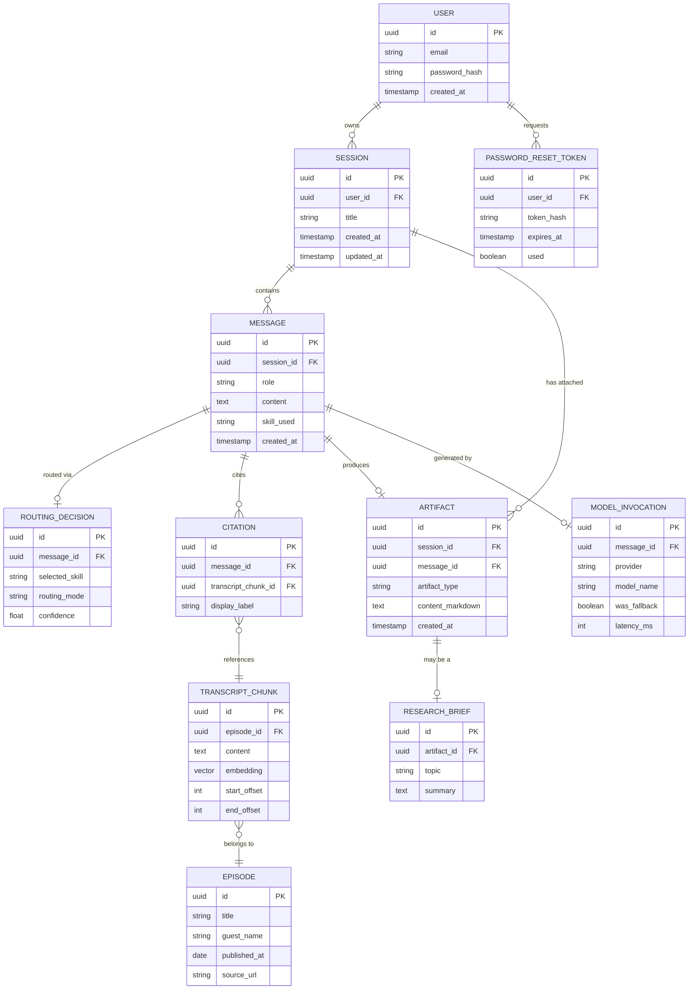

# Domain Model: Lenny Growth Workspace

| | |
|---|---|
| **Status** | Draft |
| **Version** | 0.1.0 |
| **Owner** | Engineering |
| **Last Updated** | 2026-08-02 |

Related: [PRD.md](./PRD.md) · [ARCHITECTURE.md](./ARCHITECTURE.md) · [IMPLEMENTATION_PLAN.md](./IMPLEMENTATION_PLAN.md)

---

## 1. Purpose & Ubiquitous Language

This document defines the core entities, relationships, and vocabulary shared across product, engineering, and design for Lenny Growth Workspace. Terms defined here should be used consistently in code (class/table names), API contracts, and product copy.

## 2. Core Entities (Overview)

| Entity | Description |
|---|---|
| `User` | An authenticated account holder. |
| `Session` | A chat-based unit of work containing an ordered sequence of messages and attached artifacts. |
| `Message` | A single turn in a session, authored by the user or the system, optionally tagged with the skill that produced it. |
| `RoutingDecision` | The record of which skill handled a given message, and whether via auto-routing or manual override. |
| `Skill` | One of the four capabilities that can handle a message: QA, Research, Ship30, Artifact. |
| `Episode` | A single episode of Lenny's Podcast, with metadata (title, guest, publish date). |
| `TranscriptChunk` | A retrievable segment of an episode's transcript, with an associated embedding. |
| `Citation` | A pointer from a generated response back to one or more `TranscriptChunk`s that grounded it. |
| `ResearchBrief` | A structured, multi-section synthesis output produced by the Research skill. |
| `Artifact` | A persisted, renderable output (Markdown source of truth) attached to a session/message. |
| `ModelInvocation` | A record of a single call to the model layer, including which provider actually served it. |

## 3. Entity Relationship Diagram

## 4. Entity Definitions

### 4.1 `User`
The account holder. All sessions, artifacts, and messages are scoped to exactly one owning `User`.

| Attribute | Type | Notes |
|---|---|---|
| `id` | UUID | Primary key |
| `email` | string | Unique, used for login |
| `password_hash` | string | Never exposed via API |
| `created_at` | timestamp | Account creation time |

**Invariants**: A `User` can only read/modify `Session`, `Message`, and `Artifact` records they own (enforced via RLS + application authorization).

### 4.2 `Session`
The top-level unit of work — a chat-based workspace instance. Corresponds directly to an entry in the session sidebar.

| Attribute | Type | Notes |
|---|---|---|
| `id` | UUID | Primary key |
| `user_id` | UUID | Owning user |
| `title` | string | Derived from first message or user-set |
| `created_at` / `updated_at` | timestamp | For sidebar ordering |

**Invariants**: A `Session` belongs to exactly one `User`. Deleting a session cascades to its `Message` and `Artifact` records (or soft-deletes, per retention policy — see PRD open questions).

### 4.3 `Message`
A single turn within a `Session`. `role` distinguishes user vs. system/assistant turns. `skill_used` records which skill (if any) produced a system message.

| Attribute | Type | Notes |
|---|---|---|
| `id` | UUID | Primary key |
| `session_id` | UUID | Parent session |
| `role` | enum: `user` \| `assistant` | |
| `content` | text | Rendered message body (Markdown for assistant messages) |
| `skill_used` | enum: `qa` \| `research` \| `ship30` \| `artifact` \| null | Null for user messages |
| `created_at` | timestamp | Ordering within session |

### 4.4 `RoutingDecision`
Records how a `Message` was routed — auto-classified or manually overridden — for auditability and future evaluation of routing quality.

| Attribute | Type | Notes |
|---|---|---|
| `id` | UUID | Primary key |
| `message_id` | UUID | The user message being routed |
| `selected_skill` | enum | One of the four skills |
| `routing_mode` | enum: `auto` \| `manual` | |
| `confidence` | float, nullable | Classifier confidence, if auto-routed |

### 4.5 `Skill` (conceptual, not a DB table)
A capability the router can dispatch a message to. Implemented in code as a common interface; not persisted as an entity itself, but referenced by name (`skill_used`, `selected_skill`).

| Skill | Responsibility |
|---|---|
| `qa` | Grounded question answering with inline citations |
| `research` | Cross-episode synthesis into a `ResearchBrief` |
| `ship30` | Transform session context into publishable content |
| `artifact` | Direct artifact operations (formatting/export) |

### 4.6 `Episode`
A single Lenny's Podcast episode, ingested offline. The unit of source attribution for citations.

| Attribute | Type | Notes |
|---|---|---|
| `id` | UUID | Primary key |
| `title` | string | Episode title |
| `guest_name` | string | Primary guest(s) |
| `published_at` | date | Publish date |
| `source_url` | string | Canonical link to episode |

### 4.7 `TranscriptChunk`
A retrievable segment of an `Episode`'s transcript, the atomic unit of retrieval and grounding.

| Attribute | Type | Notes |
|---|---|---|
| `id` | UUID | Primary key |
| `episode_id` | UUID | Parent episode |
| `content` | text | Chunk text |
| `embedding` | vector | `bge-m3` embedding, indexed via pgvector |
| `start_offset` / `end_offset` | int | Time or token offsets within the episode, for citation display |

**Invariants**: Every `TranscriptChunk` belongs to exactly one `Episode`. Embeddings are generated once at ingestion and must be regenerated if the embedding model changes.

### 4.8 `Citation`
Links a generated `Message` to the specific `TranscriptChunk`(s) that grounded it. This is what powers "inline citations" and "source grounding" in the PRD.

| Attribute | Type | Notes |
|---|---|---|
| `id` | UUID | Primary key |
| `message_id` | UUID | The assistant message making the claim |
| `transcript_chunk_id` | UUID | The grounding source |
| `display_label` | string | e.g., "Episode 142 — @18:32" |

**Invariants**: A `Citation` must reference a `TranscriptChunk` that was actually retrieved for the generating request — citations are assembled from retrieval metadata, never freely generated by the model (see ARCHITECTURE.md ADR discussion on hallucination risk).

### 4.9 `ResearchBrief`
A specialization of `Artifact` produced by the Research skill: a structured synthesis across multiple episodes.

| Attribute | Type | Notes |
|---|---|---|
| `id` | UUID | Primary key |
| `artifact_id` | UUID | The underlying artifact record (Markdown content) |
| `topic` | string | The research topic/question |
| `summary` | text | Top-level synthesis summary |

**Invariants**: A `ResearchBrief`'s underlying `Artifact.content_markdown` should reference multiple distinct `Episode`s when multi-episode coverage exists for the topic.

### 4.10 `Artifact`
A persisted, renderable output attached to a `Session` and the `Message` that produced it. Markdown is the canonical representation; HTML is derived at render time.

| Attribute | Type | Notes |
|---|---|---|
| `id` | UUID | Primary key |
| `session_id` | UUID | Parent session |
| `message_id` | UUID | Producing message |
| `artifact_type` | enum: `qa_answer` \| `research_brief` \| `linkedin_post` \| `x_thread` \| `article` | |
| `content_markdown` | text | Canonical source of truth |
| `created_at` | timestamp | |

**Invariants**: `Copy` and `Download` operations always operate on `content_markdown` verbatim; HTML rendering is a pure, sanitized derivation with no independent state.

### 4.11 `ModelInvocation`
An observability record of a single call into the Model Gateway, capturing which provider actually served the request (for graceful-degradation auditability).

| Attribute | Type | Notes |
|---|---|---|
| `id` | UUID | Primary key |
| `message_id` | UUID | Associated message |
| `provider` | enum: `ollama` \| `claude` | |
| `model_name` | string | e.g., model identifier used |
| `was_fallback` | boolean | True if primary (Ollama) failed and Claude was used |
| `latency_ms` | int | For performance monitoring |

### 4.12 `PasswordResetToken`
Supports the self-service password reset flow.

| Attribute | Type | Notes |
|---|---|---|
| `id` | UUID | Primary key |
| `user_id` | UUID | Requesting user |
| `token_hash` | string | Hashed token (never stored in plaintext) |
| `expires_at` | timestamp | Short-lived expiry |
| `used` | boolean | Enforces single-use |

## 5. Value Objects & Enumerations

| Enum | Values | Used by |
|---|---|---|
| `MessageRole` | `user`, `assistant` | `Message.role` |
| `SkillType` | `qa`, `research`, `ship30`, `artifact` | `Message.skill_used`, `RoutingDecision.selected_skill` |
| `RoutingMode` | `auto`, `manual` | `RoutingDecision.routing_mode` |
| `ArtifactType` | `qa_answer`, `research_brief`, `linkedin_post`, `x_thread`, `article` | `Artifact.artifact_type` |
| `ModelProvider` | `ollama`, `claude` | `ModelInvocation.provider` |

## 6. Aggregates & Consistency Boundaries

- **Session Aggregate**: `Session` is the aggregate root for `Message` and `Artifact`. All writes to messages/artifacts happen in the context of a session and are scoped/authorized via the session's `user_id`.
- **Episode Aggregate**: `Episode` is the aggregate root for `TranscriptChunk`. This aggregate is populated exclusively by the offline ingestion pipeline and is read-only from the application's perspective at request time.
- **User Aggregate**: `User` is the aggregate root for `PasswordResetToken` and, transitively, owns all `Session`s.

`Citation` and `ModelInvocation` are cross-aggregate references (linking the Session aggregate to the Episode aggregate, and to the model layer, respectively) — they are read-heavy audit/grounding records, not independently mutable entities.

## 7. Domain Events (indicative)

These represent meaningful state transitions that skills, the router, and observability tooling react to or record:

| Event | Triggered When | Consumed By |
|---|---|---|
| `UserRegistered` | New account created | Onboarding, analytics |
| `SessionCreated` | New session started | Session sidebar update |
| `MessageRouted` | Router assigns a skill to a message | `RoutingDecision` persistence, analytics |
| `AnswerGrounded` | QA/Research skill produces citations | `Citation` persistence |
| `ArtifactGenerated` | Any skill emits an artifact | Artifact panel update, session attachment |
| `ModelFallbackTriggered` | Ollama unavailable, Claude SDK invoked | Observability/alerting |

## 8. Glossary

| Term | Definition |
|---|---|
| **Session** | The persisted, chat-based unit of work a user creates and resumes. |
| **Skill** | One of the four dispatchable capabilities (QA, Research, Ship30, Artifact). |
| **Router** | The component that assigns an incoming message to a skill, via auto-classification or manual override. |
| **Grounding** | The property of a response being traceable to specific retrieved `TranscriptChunk`s. |
| **Citation** | A structured pointer from a response to its grounding source. |
| **Artifact** | A persisted, renderable, copy/downloadable output distinct from the raw chat transcript. |
| **Research Brief** | A structured, multi-section artifact synthesizing insights across episodes. |
| **Graceful Degradation** | The system's ability to continue serving requests via a secondary model provider when the primary is unavailable. |
| **Transcript Chunk** | The atomic, embedded unit of retrieval from an episode transcript. |
