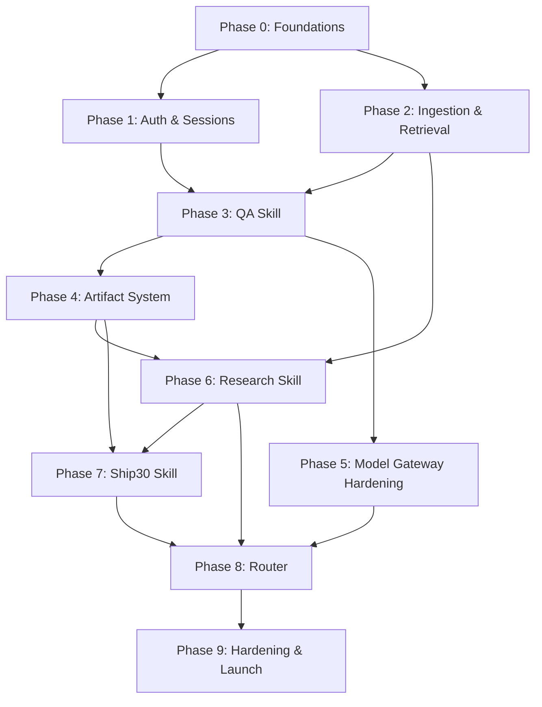

# Implementation Plan: Lenny Growth Workspace

| | |
|---|---|
| **Status** | Draft |
| **Version** | 0.1.0 |
| **Owner** | Engineering |
| **Last Updated** | 2026-08-02 |

Related: [PRD.md](./PRD.md) · [ARCHITECTURE.md](./ARCHITECTURE.md) · [DOMAIN_MODEL.md](./DOMAIN_MODEL.md)

---

## 1. Approach

Work is sequenced so that each phase produces a demonstrable, end-to-end slice rather than a horizontal layer (e.g., "all backend, then all frontend"). Retrieval and grounding (QA) are built before Research and Ship30 because those skills depend on the same retrieval layer and on session/artifact plumbing being in place. The Router is introduced after at least two skills exist, since routing has nothing meaningful to choose between with only one.

## 2. Phases

### Phase 0 — Foundations
**Goal**: Stand up the base platform so every subsequent phase has somewhere to land.

- Repository scaffolding: Next.js 15 (TypeScript, Tailwind, shadcn/ui) frontend; FastAPI backend.
- Supabase project provisioning: Postgres instance, `pgvector` extension enabled.
- Core schema migration: `users`, `sessions`, `messages`, `artifacts` tables (per DOMAIN_MODEL.md).
- Local dev environment: Ollama installed and running `bge-m3` + a chosen generation model.
- Model Gateway skeleton: single interface with a stubbed Ollama client (Claude fallback added in Phase 5).
- CI baseline: lint, type-check, test runner wired for both frontend and backend.

**Exit criteria**: A blank authenticated shell app deploys, frontend can call a backend health endpoint, and the DB schema is migratable.

### Phase 1 — Authentication & Session Management
**Goal**: Users can create accounts and durable sessions.

- Backend: register, login, logout, password reset endpoints (token issuance, hashing, RLS policies on `users`/`sessions`).
- Frontend: auth screens (register/login/reset), auth-guarded routing.
- Session CRUD: create session, list sessions (sidebar), reopen session (load message history — empty at this stage).
- Domain entities implemented: `User`, `Session`, `Message` (schema + API, no skill logic yet), `PasswordResetToken`.

**Exit criteria**: A user can register, log in, create a session, log out, log back in, and see that session in the sidebar.

### Phase 2 — Transcript Ingestion & Retrieval Layer
**Goal**: The podcast corpus is searchable before any skill needs to use it.

- Offline ingestion pipeline: transcript intake → chunking strategy → `bge-m3` embedding via Ollama → upsert into `episodes` / `transcript_chunks` tables.
- pgvector indexing (HNSW/IVFFlat) and retrieval query implementation (top-k similarity search with metadata filters).
- Retrieval Layer module exposed to the backend (`retrieval/`) with a query API: `search(query_text, k, filters) -> TranscriptChunk[]`.
- Ingest an initial batch of episodes (subset) to validate the pipeline end-to-end before full corpus ingestion.

**Exit criteria**: A retrieval query against the ingested subset returns relevant, correctly-scored transcript chunks with resolvable episode metadata.

### Phase 3 — QA Skill (RAG, Citations, Grounding)
**Goal**: First user-facing skill — grounded question answering.

- QA skill module: retrieval call → prompt construction → generation via Model Gateway (Ollama only at this point) → streamed response.
- Citation assembly: map generated response back to retrieved `TranscriptChunk`s, persist `Citation` records, render inline citations in the frontend.
- Frontend: chat interface (message list, streaming render), citation UI (hover/click to source).
- No router yet — all messages in a session are implicitly handled by QA.

**Exit criteria**: A user can ask a question in a session and receive a streamed, cited, source-grounded answer; citations resolve to real episode/timestamp metadata.

### Phase 4 — Artifact System
**Goal**: Outputs become persistent, portable artifacts rather than living only in chat.

- `Artifact` entity + API: create/read artifacts scoped to session/message.
- Frontend artifact panel: Markdown rendering, sanitized HTML rendering toggle, Copy button, Download-as-`.md` button.
- Wire QA answers to optionally be "saved as artifact" (artifact_type = `qa_answer`), establishing the pattern later skills reuse.

**Exit criteria**: A QA answer can be saved, rendered in both Markdown and HTML views, copied, and downloaded, with content matching exactly across all three surfaces.

### Phase 5 — Model Gateway Hardening: Graceful Degradation
**Goal**: Reliability work — the secondary model path goes live.

- Integrate Claude SDK as the secondary provider in the Model Gateway.
- Implement health-check/timeout/failover logic (Ollama → Claude) with `ModelInvocation` logging (`provider`, `was_fallback`, `latency_ms`).
- Frontend: subtle degraded-mode indicator when a response was served via fallback.
- Load/failure testing: simulate Ollama unavailability and confirm seamless fallback with no user-facing hard failure.

**Exit criteria**: Killing the local Ollama process mid-session results in continued (fallback) service, not an error state, and the fallback is recorded and observable.

### Phase 6 — Research Skill
**Goal**: Cross-episode synthesis, building directly on the retrieval layer and artifact system.

- Research skill module: multi-query/multi-retrieval strategy across episodes for a given topic.
- Synthesis prompt design: structured output (summary, per-guest perspectives, agreement/disagreement, citations).
- `ResearchBrief` entity wired to `Artifact` (artifact_type = `research_brief`).
- Frontend: research-specific rendering (sectioned brief view) reusing the artifact panel.

**Exit criteria**: A research request on a multi-episode topic produces a structured, multi-source-cited brief, saved as an artifact.

### Phase 7 — Ship30 Skill
**Goal**: Turn session context into publishable content.

- Ship30 skill module: consumes prior session context (QA answers, research briefs) as source material.
- Three generation modes: LinkedIn post, X/Twitter thread (with segmentation logic), article.
- Frontend: content-type selector when invoking Ship30; thread-specific rendering (numbered segments).
- Artifact types added: `linkedin_post`, `x_thread`, `article`.

**Exit criteria**: From an existing QA/Research artifact in a session, a user can generate all three content types, each saved as a distinct, correctly formatted artifact.

### Phase 8 — Router (Auto + Manual)
**Goal**: Unify the four skills behind intelligent dispatch, now that all four exist.

- Router module: classification logic (start rule/heuristic-based on message patterns; evaluate need for a model-assisted classifier) selecting among `qa | research | ship30 | artifact`.
- `RoutingDecision` persistence per message (`selected_skill`, `routing_mode`, `confidence`).
- Frontend: skill indicator on each assistant message; manual override control (explicit skill selector) that bypasses the classifier.
- Replace the Phase 3 QA-only default with full router dispatch across all sessions.

**Exit criteria**: Ambiguous and clear-intent messages route to the expected skill at an acceptable accuracy rate; manual override always takes precedence and is visibly available.

### Phase 9 — Hardening, Security Review, Launch Readiness
**Goal**: Production readiness across security, performance, and polish.

- Security pass: RLS policy audit, XSS sanitization audit on HTML artifact rendering, password/token handling review, dependency audit.
- Performance pass: pgvector index tuning at expected corpus scale, streaming latency budget validation, model concurrency/queuing under load.
- Observability: dashboards for routing accuracy, citation coverage, fallback rate (per PRD success metrics).
- Full corpus ingestion (all Lenny's Podcast episodes) if not already complete.
- Cross-browser/responsive QA on frontend; accessibility pass on shadcn/ui components.

**Exit criteria**: All PRD acceptance criteria met; success metrics instrumented and reporting; no open critical/high security findings.

## 3. Phase Dependency Graph

## 4. Milestones

| Milestone | Phases Complete | Demonstrable Outcome |
|---|---|---|
| **M1 — Walking Skeleton** | 0–1 | Auth + session creation works end-to-end |
| **M2 — Grounded Answers** | 2–4 | Cited QA answers, saved as downloadable artifacts |
| **M3 — Resilient Core** | 5 | Model layer survives local-model outages transparently |
| **M4 — Full Skill Set** | 6–7 | Research briefs and Ship30 content generation both work |
| **M5 — Unified Workspace** | 8 | Auto-routing + manual override across all skills |
| **M6 — Launch Ready** | 9 | Security/performance hardened, fully instrumented |

## 5. Team & Ownership (indicative)

| Area | Ownership |
|---|---|
| Frontend (Next.js/UI) | 1–2 frontend engineers |
| Backend (FastAPI/skills/router) | 1–2 backend engineers |
| Retrieval/Embeddings/Ingestion | 1 ML/data engineer (can overlap with backend) |
| Database/Infra (Supabase, deployment) | 1 engineer (can overlap with backend) |
| Security review | Cross-functional, concentrated in Phase 9 |

## 6. Testing Strategy

- **Unit tests**: skill logic (retrieval query construction, citation assembly, content-type formatting), router classification, auth flows.
- **Integration tests**: end-to-end message → route → skill → artifact flows against a test database with a seeded transcript subset.
- **Contract tests**: frontend/backend API and streaming payload shapes.
- **Failover tests**: forced Ollama outage to validate Claude SDK fallback (Phase 5, re-run in Phase 9).
- **Grounding evaluation**: a held-out set of Q&A pairs with known correct citations, used to measure citation coverage/accuracy as a recurring check, not just a one-time gate.
- **Routing evaluation**: labeled message set to measure auto-routing accuracy against manual-override "corrections" logged in production.

## 7. Risk Mitigation Timeline

| Risk (from PRD) | Addressed In |
|---|---|
| Local model unavailable | Phase 5 (graceful degradation) |
| Citation hallucination | Phase 3 (citations built from retrieval metadata, not free generation) |
| Router misclassification | Phase 8 (manual override always available; routing logged from day one) |
| Corpus/ASR quality gaps | Phase 2 (validate on subset before full ingestion), ongoing evaluation in Phase 9 |
| Cross-user data leakage | Phase 1 (RLS from the start), audited again in Phase 9 |

## 8. Rollout Plan

1. **Internal dogfooding** after M2 (grounded QA + artifacts) — smallest useful slice for early feedback.
2. **Closed beta** after M4 (full skill set) — invite target personas (growth PMs, founders, content creators) from the PRD.
3. **General availability** after M6 — full security/performance hardening complete, success metrics instrumented.

## 9. Explicitly Deferred (see PRD Out of Scope)

- Multi-corpus ingestion beyond Lenny's Podcast.
- Native publishing integrations (LinkedIn/X APIs).
- Real-time multi-user collaboration within a session.
- Additional export formats beyond Markdown/HTML (e.g., PDF) — revisit post-GA based on demand.
